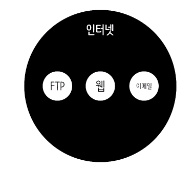

# 웹 어플리케이션 만들기

## 수업소개
### 우리가 하려는 것
1. 게시판 제작
2. 글 쓰기 지우기 기능
3. 반응형 웹

-----------------

## 웹 어플리케이션을 만드는 순서
1. 구상
2. 기획 (계획)
3. 디자인 (UX UI)
4. 개발
5. 테스트 (QA)

### Start Small
### 복잡도

-----------------

## 구상 & 계획

1. 무엇을 만들것인가?
    1. 어떤 것을 보여줄 것인지
    2. 어떤 방식으로 보여줄 것인지
2. 어떻게 동작해야 하는가?
    - UI 모델링
        1. UI : 사용자가 시스템을 제어하는 조작장치
        2. 모델링 : 가상으로 만들어 보는 것. **소통의 도구!**
        - [oven](https://ovenapp.io/)

-------

## 인터넷과 웹의 역사

### 인터넷 =/= 웹

- 인터넷 : 전 세계에서 가장 거대한 네트워크
- 웹 : 인터넷을 활용하여 HTML을 주고 받을 수 있도록 한 서비스

**웹은 가장 성공한 인터넷의 서비스이다.**

### 팀 버너스리

----------------

## 서버와 클라이언트

- 인터넷 상의 서비스들은 서버와 클라이언트라는 체계 위에서 동작한다.
- 모든 컴퓨터는 서버 혹은 클라이언트가 될 수 있다.
    - 서버와 클라이언트는 상대적인 개념이다.