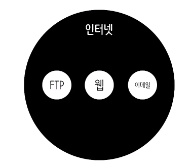
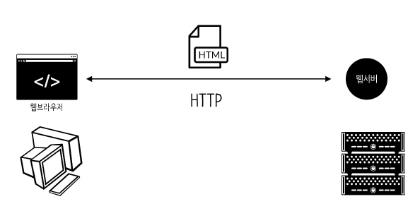
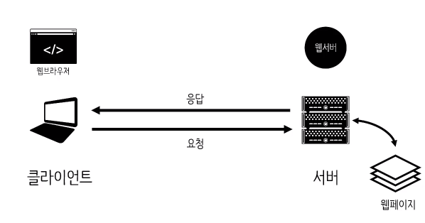
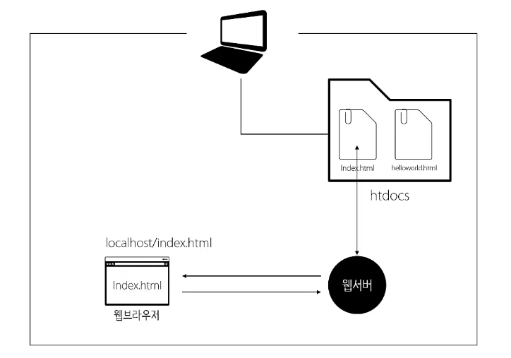
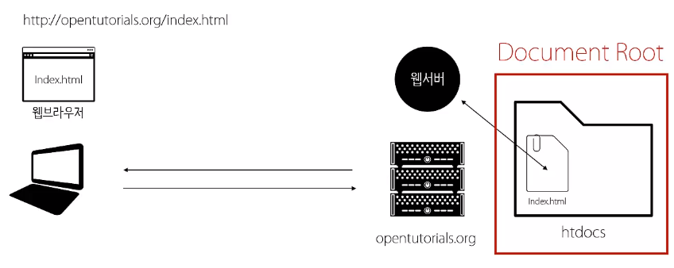
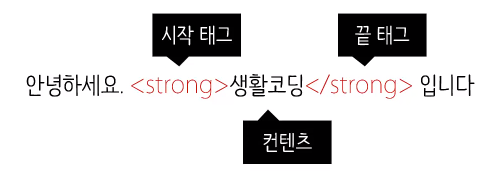
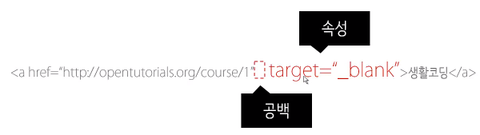
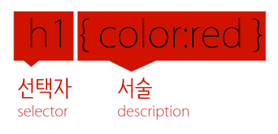
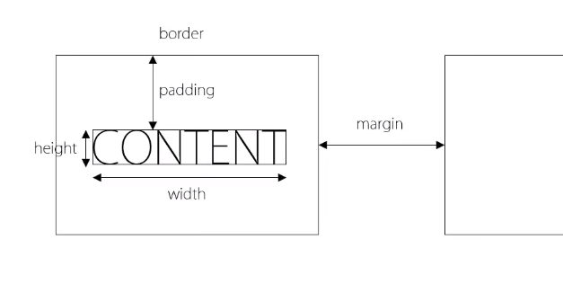
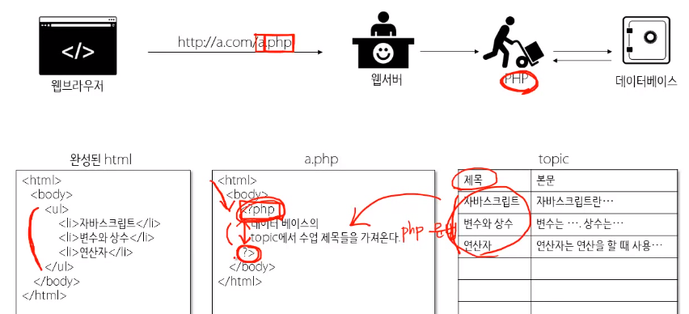

# 웹 어플리케이션 만들기

## 수업소개
### 우리가 하려는 것
1. 게시판 제작
2. 글 쓰기 지우기 기능
3. 반응형 웹

-----------------

## 웹 어플리케이션을 만드는 순서
1. 구상
2. 기획 (계획)
3. 디자인 (UX UI)
4. 개발
5. 테스트 (QA)

### Start Small
### 복잡도

-----------------

## 구상 & 계획

1. 무엇을 만들것인가?
    1. 어떤 것을 보여줄 것인지
    2. 어떤 방식으로 보여줄 것인지
2. 어떻게 동작해야 하는가?
    - UI 모델링
        1. UI : 사용자가 시스템을 제어하는 조작장치
        2. 모델링 : 가상으로 만들어 보는 것. **소통의 도구!**
        - [oven](https://ovenapp.io/)

-------

## 인터넷과 웹의 역사

### 인터넷 =/= 웹


- 인터넷 : 전 세계에서 가장 거대한 네트워크
- 웹 : 인터넷을 활용하여 HTML을 주고 받을 수 있도록 한 서비스


**웹은 가장 성공한 인터넷의 서비스이다.**

### 팀 버너스리



----------------


## 서버와 클라이언트


- 인터넷 상의 서비스들은 서버와 클라이언트라는 체계 위에서 동작한다.
- 모든 컴퓨터는 서버 혹은 클라이언트가 될 수 있다.
    - 서버와 클라이언트는 상대적인 개념이다.

### 준비물
- 웹 브라우저 : 크롬
- 웹 서버 : Bitnami (Apache)
    - 앞으론 뭔가를 설치할 때 각오하자.

--------

## 웹서버 설치

### bitnami 설치



-----------

## 서버 제어

### wampstack manager stack
- Apache나 MySQL을 켜고 끌 수 있다.
- 윈도우는 항상 켜져있다.
- Configure에서 여러 정보 확인/수정 가능 


--------

## 프로그래밍 언어

사람과 컴퓨터 사이의 약속

코드, 소스 : 사람이 작성하는 소프트웨어(프로그램)의 설계도

---------

## HTML 이론

### Hypertext Markup Lanuage
- Hypertext : 문서와 문서가 **링크**로 연결되어 있다.
- 링크로 인해 문서와 문서가 그물망 처럼 연결되어 거대한 정보 덩어리를 만든것이 웹
- Markup : TAG.



### HTML 문법 - 속성
#### 하이퍼링크 : a태그


- a태그만으론 이를 표현할 수 없다.
    - 이때 사용하는 것이 바로 속성

``` 
<a href="http://opentutorials.org/course/1">생활코딩</a> 
<a href="http://opentutorials.org/course/1" target="_blank">생활코딩</a>
<a href="http://opentutorials.org/course/1" target="self">생활코딩</a>
```


### HTML 문법 - 태그의 중첩

#### LIST : ul태그, ol태그, li태그

- li : 리스트 아이템
- ul : unordered list - 순서가 없는 리스트
- ol : ordered list - 순서가 있 리스트

#### 태그의 중첩
- html : 태그 안쪽의 내용이 html이다.
- head : 문서를 설명하는 내용
- body : 문서의 내용 (본문)

```
<html>
    <head>
        <meta charset="utf-8" />
        <title>생활코딩</title>
    </head>
    <body>
        .....
    </body>
</html>
```

### HTML 정리
- 팀 버너스리에 의해 만들어지고 W3C에 의해 표준이 정의됨

``` <!DOCTYPE html> ```
- 해당 html 문서가 어떤 표준인지 말해준다.

#### TAG Reference
- [W3C](http://dev.w3.org/html5/html-author/)
- [Opentutorials Html Reference](http://opentutorials.org/course/1058)

#### HTML의 본질
- 어떠한 정보를 사람도, 컴퓨터도 이해할 수 있게 태그를 이용해서 규정하고 정의!
    - 꾸미는 역할은 CSS에게, 나머지는 JS에게 맡김.
    - HTML은 정보를 정의!

#### 웹 접근성
- 시각장애인들은 어떻게 웹을 탐색하고 정보를 파악할까?
    -  전맹 시각장애인은 화면 읽기 프로그램(이하 스크린 리더)와 키보드를 사용하여 정보를 탐색
    - 저시력 시각장애인은 화면 확대 프로그램과 고대비, 반전 등의 기능을 사용합니다.
- 스크린 리더 사용자는 정보를 인식하고 운용하기 위해 이미지의 대체 텍스트, 모든 콘텐츠의 키보드 접근, 초점의 논리적인 이동 등이 절대적으로 보장되어야 합니다.
- 효율적인 탐색을 위해서 문서의 구조화(HTML 5의 시맨틱 테그 사용과 헤딩, 랜드마크 등)이 매우 중요합니다.
- 입력서식의 레이블과 테이블 scope 등도 정보 파악에 큰 도움이 됩니다. 
- **결론적으로 표준을 잘 지키고 기본에 충실한 것이 가장 좋다**

---------------------

## HTML 실습

### 모델링을 HTML로 만들기
- 제목 태그 (H태그)
    - H1 ~ H6 까지 제목을 표시할 수 있다.

    ``` <h1>제목</h1> ```

- 목록은 List 태그를 사용.
- 이러한 과정을 마크업 과정이라고 한다.

### 의미론적인 웹
- Semantic Web : 의미가 잘 드러나는 웹
- 웹에서 HTML이 차지하는 역할은 정보! 이 역할에 충실하기 위해 HTML은 발전해 왔다.
    - 디자인 담당하는 태그나 역할은 전부 CSS로 갔다.
    - HTML 문서에서 정보로써의 가치를 높여주는 시멘틱 태그들이 나타났다.
- 사람 뿐아니라 기계들도 HTML의 의미를 이해할 수 있도록 하는 태그들
    - 특별한 기능이 있는 것은 아니다.
    - ```<header>``` : 헤더. 해당 문서의 간판.
    - ```<nav>``` : 네비게이션. 내부의 내용은 웹 사이트를 탐색할때 사용된다는 뜻.
    - ```<article>``` : 아티클. 문서의 본문
    - ```<footer>``` : 푸터. 문서의 끝부분. 부가정보

### 사이트 완성
- index.html(확장자는 중요하지 않다.)
    - 웹 서버의 대문과도 같은 페이지.
    - 일반 주소를 치면 해당 페이지가 나오게 된다.
    - nav 영역의 항목들은 링크로 해줘야 한다.

-------------

## 개발도구

### 도구의 필요성
- 파워풀한 도구일 수록 잘 다루기 힘들다. 학습비용이 들게된다.
- 버전 관리 시스템 (Version Control System)
    - 변경된 코드에 대한 기록을 해준다.
    - 언제 어디서 문제가 발생했는지 쉽게 알 수 있다.
    - 다른 서버 컴퓨터에 백업하여 만약의 사고에 대비할 수 있다.
    - 협업시 똑같은 파일을 수정할 때 지침이 되어준다.
    - SVN, git 
- 코드 편집기 (Editor)
    - [Atom](https://atom.io/)
    - 좋은 도구를 사용하도록 노력해야 한다.

### Atom
- Opne Folder에서 Root Directory를 설정한다.
- 에디터의 확장기능(패키지, 플러그인)
    - file > Settings 에서 설치가능
    - emmet

-------

## CSS 이론

### CSS 기본문법
- Cascading Style Sheet
- Style : 정보(HTML)를 예쁘게 꾸며주는 역할
- sytle태그 : 내부 내용을 CSS로 해석해야 함을 알려주는 태그
#### 선택자


### 선택자 심화학습
- 태그에게 효과를 주는 하나 하나를 **속성**이라고 한다.
- 속성과 속성을 구분해주는 구분자는 세미콜론(;)
- 선택자를 사용하여 세부적인 내용을 수정할 수 있다.

```
<style>
    h1,h2 {
        color:red;
        font-size:10px;
    }
    h2 {
        text-decoration: underline;
    }
    header h1{
        border : 1px solid blue;
    }
</style>
```

### 박스 모델
- 태그들의 위치, 부피, 여백을 지정
- HTML의 id 속성 : 특정 태그만을 선택하려고 할때 사용
    - ``` <tag id="id_name">contents</tag> ```
    - CSS에서 ```#id_name { ... }``` 으로 사용 가능

- border 속성 : 테두리.
    - 두께, 색상, 선의 종류를 띄어쓰기를 사용하여 구분후 작성
    - ``` border: red 1px solid; ```

- padding : 테두리와 컨텐츠 사이의 거리
- margin : 태그와 태그 사이의 간격


- 구글 개발자 도구로 박스모델 알아보기

### float 

- img 태그 : 이미지를 표현
    - ```  ```
- float 속성 : 두 개의 컨텐츠가 나란히 화면에 배치되게 한다.
    - right 혹은 left 를 값으로 준다.
    - ``` float:right; ```


-----

## CSS 실습

- CSS 외부 분리 후 링크 : 여러 페이지에 하나의 동일한 CSS를 적용시키고 싶을 때. **중복의 제거**
    - 확장자가 css인 파일을 만들고 거기에 css 코드를 입력
    - 아래의 코드를 head 태그 내부에 입력
    - ``` <link rel="stylesheet" type="text/css" href="css_url"> ```


- style.css
```
header{
    border-bottom:1px solid gray;
    padding:20px;
}
nav {
    border-right:1px solid gray;
    width:200px;
    height:600px;
    float:left;
}
nav ol{
    list-style:none;
}
article{
    float:left;
    padding:20px;
}
h2{
    font-size:50px;
}
```

- stylebot

------

## 프로그래밍 (JS, PHP 이론)

1. HTML
    - 웹의 태동과 같이 나옴.
    - 정보를 전달
2. CSS
    - 디자인을 담당
3. JavaScript
    - 사용자의 동작에 따른 웹 페이지와 사용자간의 상호작용
4. PHP
    - 웹 페이지를 보여주거나 생산하는데 생산성을 높여준 언어
5. MySQL
    - 수 많은 데이터를 관리할 수 있는 데이터베이스

#### 이러한 것들이 모여 거대한 웹을 이룬다.

-------

## 프로그래밍 - 복습과 수업 예고

#### 클라이언트에서 동작하는 언어들
- Front-end
- Client-side


#### 서버에서 동작하는 언어들
- Back-end
- Server-side


------------

## JavaScript vs PHP

- JavaScript는 웹 브라우저에서 PHP는 서버에서 작동한다.
    - 이 둘은 경쟁적이며 협력적인 관계

- HTML, CSS는 정적인 언어
    - 문서의 정보와 스타일을 위한 정적인 언어.
- JavaScript와 PHP는 동적인 언어이다.
    - 상황에 따라 다르게 동작하는 동적인 언어.
    - HTML에서 CSS를 분리시킨것 처럼, HTML에서 정보만 따로 분리하여 불러오는 것이 PHP의 능력이다.


-----------

## 웹페이지에 코드 삽입하기

### PHP
```
<?php
    ....
?>
```
- PHP 문서에서 ```<?php ?>``` 사용
- 내부의 코드는 php의 문법으로 해석된다.
- 이는 서버에서 해석되며, 브라우저에는 결과만 나타난다.
    - 웹 서버는 php 문서를 요청 받으면 해당 php문서를 php 인터프리터에게 넘기며 php 인터프리터는 웹 서버에게 코드를 해석한 결과를 전달한다.

### JavaScript
```
<script>
    ....
</script>
```
- HTML, PHP 문서에서 ```<script>``` 태그 사용
- 내부의 코드는 JavaScript의 문법으로 해석된다.
- 이는 브라우저에서 해석되며 브라우저에서 코드도 확인할 수 있다.

--------

## 데이터타입과 연산자