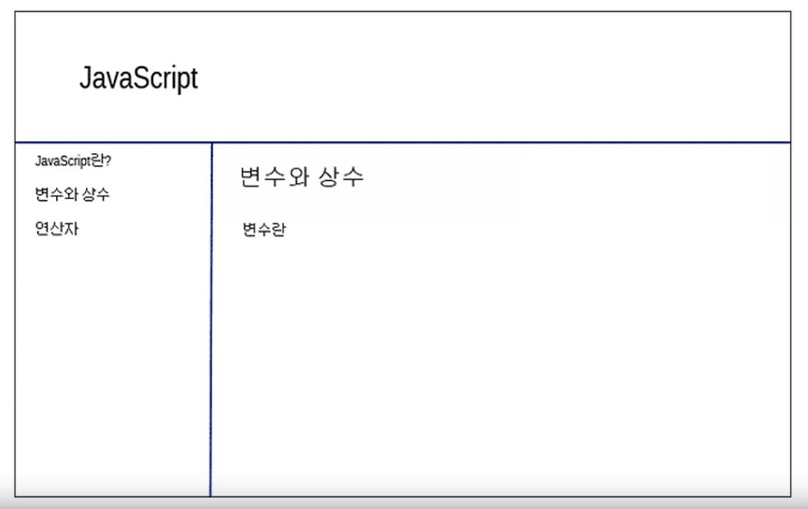

# 1주차 - 웹 어플리케이션 만들기 실습자료

1. 아래의 페이지를 구현하세요


2. 1번의 페이지에서 처음에 로그인 기능을 추가하세요. (javascript로 구현)
    - 비밀번호만 입력, 비밀번호는 1111
    - 로그인 실패시 '로그인에 실패하였습니다' 출력
    - 로그인 성공시 1번의 페이지 출력
    - 아래의 코드처럼 ``` ` ```를 사용하면 여러줄에 걸쳐서 문자열 입력가능

    ```
    a = `
        <body>
            <h1>Hello</h1>
        </body>
    `
    ```