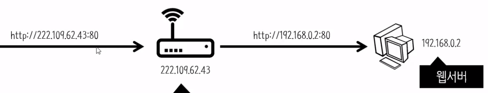

# 2-2주차 - 웹 어플리케이션 만들기 수업자료

## 인터넷

- 인터넷 : 웹이 동작하는 기반이 되는 플렛폼
    - 웹 어플리케이션에 모든 사람이 접속(실제로 서비스)할 수 있도록 인터넷을 알아야 한다.
    - 복잡한 개념이기 때문에 중요한 개념만 배운다.


### ip와 도메인 

- IP 주소 (Internet Protocol Address)
    - IP(Internet Protocol) : 인터넷이라는 체계가 동작하기 위해서 지켜야 하는 규칙
    - 각각의 컴퓨터들이 정보를 주고받기 위해 가지고 있는 주소

- 다른 컴퓨터(서버)에 접속하는 방법은 2가지
    1. IP 주소(59.18.44.119)를 통해
    2. 도메인(google.com)을 통해

- 정보를 받는 쪽(요청하는 쪽)도 IP 주소를 가져야 한다.


- IP 주소를 기억하기 힘들기 때문에 **도메인 네임(Domain Name)**을 사용한다.
    - 도메인 네임을 치면 그에 해당되는 IP 주소로 접속한다.
    - 실제 컴퓨터가 동작할 때는 도메인을 통해서 서버에 접속하지 못한다.
        - 도메인은 사람이 보기 편한것일 뿐

- DNS (Domain Name Systeme)
    - 도메인을 통해서 해당 IP로 접속할수 있게 만들어주는 시스템
    - IP의 이름이라 할 수 있는 도메인 네임이 동작하는 체계
    - 도메인을 입력하면 네임서버에 접속해서 IP를 알아낸 후 해당 IP의 서버로 접속한다.
        - 네임서버 역시 인터넷에 있는 하나의 서버일 뿐이지만 특별한 일을 하는 것이다.


- 도메인은 구입해야 한다.

### IPv6

- 현재의 IP주소 체계(IPv4)로는 42억개의 주소를 할당할 수 있는데, 이는 부족하다.
    - 여러가지 방법이 고안되었다.

- 외부에서 '나'의 IP를 입력해도 사용자들은 찾아 올 수 없다.
    - 서버에 접속할 수 없는 이유를 IP주소 부족의 문제의 틀에서 생각해보자

1. IPv6 : 새로운 IP 주소 체계
2. 사설 IP(Private IP)

### 포트


- 공유기
    - 통신사와 계약한 하나의 회선으로 여러 컴퓨터가 인터넷을 쓸 수 있다.
    - 내가 알아본 나의 IP는 현재 컴퓨터의 IP가 아닌, 공유기의 IP이다.

- 공인 IP와 사설 IP
    - 공인 IP
        - 인터넷 전체에서 유일무이한 IP
        - 공유기로 연결되어 있다면 해당 공유기가 공인 IP를 가진다.
    - 사설 IP
        - 하나의 공인 IP에서 공유기를 통해 여러개의 사설 IP를 만들어 낼 수 있다.
        - 나의 컴퓨터는 이러한 사설 IP를 가진다.

- 사설 IP를 쓴다면 포트 포워딩(port forwarding)을 통해서 사람들이 나의 웹 서버에 접속할 수 있다. 
    - 포트 포워딩 : 공인 IP로 접속한 사용자를 사설 IP를 가진 컴퓨터로 이동 시켜준다.


- PORT
    - ```http://22.109.62.43:80```
        - 22.109.62.43의 IP 주소를 가지는 컴퓨터(서버)에 http 프로토콜로 80번 포트를 사용하여 접속한다.
    - 하나의 컴퓨터에는 약 65,000개의 문이 있고 이것이 포트이다.
        - 이러한 문들은 각자 번호를 갖고있다.
    - 하나의 컴퓨터에는 여러가지 프로그램이 설치될 수 있고, 각각의 프로그램들은 인터넷에 연결되어 있을 수도 있다.
        - 즉, 다른 컴퓨터에서 특정 컴퓨터의 IP만으로 접속했을 때 해당 서버(컴퓨터)는 어떤 프로그램으로 응답해줘야 하는지 알지 못한다.
    - 웹은 80 혹은 8080, MySQL은 3306의 포트 번호를 가진다.

- 포트 포워딩 (Port Forwarding)
    - 특정 포트로 접속하면 특정한 사설 IP로 해당 요청을 넘겨주도록 한다.


### 포트포워딩


- 현재 공유기의 상황은 이렇게 되어있을 것이다.
- 내 컴퓨터에서 공유기로 접속하기 위해서는 192.168.0.1의 주소로 접속하면 된다.

#### iptime 기준 공유기 설정
1. 192.168.0.1 로 공유기 접속
2. 관리도구로 들어간다.
3. 고급설정 > NAT/라우터 관리 > 포트포워드 설정으로 들어간다.
    - 이후 설정을 위해서는 자신의 사설 IP 주소를 알아야한다.
        - 공유기 설정에서 알 수 있다.
        - cmd > ipconfig > 이더넷 어댑터(혹은 무선) 이더넷 > IPv4 주소 를 확인하면 된다.
4. 외부 포트와 내부 포트를 설정한다.
    - windows의 경우 : 외부 포트 : 80, 내부 포트 : 80
        - 
    - Mac의 경우 : 외부 포트 : 80, 내부 포트 : 8080
        - 
5. 규칙이름 설정 후 추가.


### 절대경로, 상대경로
- 현재 웹 사이트의 a태그의 href값은 ```http://localhost/...``` 으로 되어 있다.
    - 이렇게 되어 있는 것은 절대경로이고 이는 문제가 생길 수 있다.

- 집 주소일 경우
    - 절대경로 : 서울시 서울동 서울 아파트 302호
    - 상대경로 : (서울시 서울동 서울 아파트 301호에 살고 있는 사람) 옆집

### 절대경로 : 나의 위치와 무관한 위치
### 상대경로 : 나의 위치에 따라서 달라지는 위치
- ``` http://localhost/path/1.html``` 에서 ```index.php```파일을 가리킬 때
    - 절대경로 : ```http://localhost/index.php``` 혹은 ```/index.php```
        - ```/```는 경로상에서 최상위 디렉토리를 의미한다.
    - 상대경로 : ```../index.php```
        - ```.```은 현재 디렉토리
            - 같은 디렉토리에 있다면 ```./index.php``` 혹은 ```index.php```로 접근 가능하다.
            - 즉 ```./```은 생략 가능하다.
        - ```..```은 부모 디렉토리
    
- 앞의 주소가 안바뀌고 싶다면 상대경로 혹은 ```/index.php```와 같은 경로(최상위 디렉토리를 사용한 절대경로)를 사용한다.

### 기본 페이지
- 주소만 입력한다면 파일명이 ```index```인 것을 찾아서 접속한다.
- ```http://localhost``` == ```http://localhost/index.php```


### 유동IP와 DDNS

#### 유동 IP (dynamic address)
- IP고갈되는 것에 대한 대책 중 하나.
- 각 세대마다 통신사에서 부여한 각각의 공인 IP를 갖고 있다
    - 하지만 해당 IP를 오랫동안 쓰지 않을 경우 통신사는 부여한 공인 IP를 회수하여 다른곳에 준다.
    - 다시 IP를 사용 한다면 새로운 IP를 제공한다.
- 유동 IP를 쓸 경우, 네임서버에 IP를 등록해도 네임서버는 IP가 변경되는 것을 알지 못하기 때문에 문제가 생긴다.
    - 

#### DDNS (Dynamic DNS)
- 유동 IP로 인해 생기는 문제를 해결
- DDNS를 사용하게 되면 나의 컴퓨터에 특정 프로그램이 설치된다.
    - 해당 프로그램은 매 시간마다 네임서버에 접속하여, 자신의 컴퓨터의 IP를 계속해서 네임서버에 알려준다.
    - 유동 IP 체계로 IP가 변경되더라도 네임서버는 변경된 IP를 가질 수 있게된다.
    - 

#### DDNS는 도메인과 호스트의 IP를 지속적으로 일치화(동기화) 시킨다.


#### iptime DDNS 설정하기
1. iptime 공유기 관리자로 접속
2. 고급설정 > 특수기능 > DDNS 설정
3. 호스트이름은 ```******.iptime.org``` 를 사용한다.
    - iptime이 자체적으로 제공하는 도메인을 사용할 수 있다.
    - DDNS의 기능은 공유기가 자체적으로 처리해 준다.
    - 이로써 공인 IP가 바뀌어도 해당 도메인의 호스트 IP는 지속적으로 동기화된다.

- [FreeDNS](http://freedns.afraid.org) 를 통해 DDNS 기능을 사용할 수 있다.

------------------------------------

## 호스팅과 클라우드

### 호스팅
- 호스트(HOST) : 인터넷에 접속된 기기 하나하나
- 호스팅(HOSTING) : 서버쪽에서 사용되는 컴퓨터를 제공하는 사업자
    - IDC (Internet Data Center) : 서버가 동작하기에 최적의 조건의 갖춘 센터
    - 수준높은 보안/네트워크 성능을 가진 서버의 운영을 대행

### 호스팅의 종류
1. 웹 호스팅 : 웹 어플리케이션 운영을 위한 모든 것을 제공
    - 서버 + 웹서버 + 미들웨어 + 데이터베이스 제공
    - 장점 : 어플리케이션을 업로드만 하면 된다.
    - 단점 : 웹 어플리케이션을 위한 용도로만 사용
2. 서버 호스팅 : 컴퓨터(서버)를 제공
    - 서버만 제공, 자신이 필요한 것들은 직접설치하고 운영해야한다.
    - 장점 : 모든 것을 할 수 있다.
    - 단점 : 직접 운영해야 한다.


### 클라우드 컴퓨팅
- 클라우드 컴퓨팅도 결국 호스팅이지만, 질정/양적으로 많은 발전이 있기 때문에 다른 개념처럼 생각하여야 한다.
    - 종량제 : 쓰는만큼 돈을 낸다.
    - 가상화(가상머신) : 물리적인 컴퓨터는 아니지만 물리적인 컴퓨터처럼 행동함
        - 기계인것 처럼 동작하는 소프트웨어
        - 하나의 물리적 기계 안에 여러개의 운영체제를 설치하여 마치 여러개의 컴퓨터가 있는 것 처럼 운영할 수 있다.
    - 종량제와 가상화를 통해서 내가 필요한 양과 시간으로 시스템을 빌릴 수 있다. 


------------------------------------

## 성장 (Scalability)

- 규모의 발전
    - HTML 부터 시작한 웹이 이제는 PHP나 MySQL 등을 통해서 제공된다.
    - 하나의 컴퓨터로 제공하는 시스템을 여러대의 컴퓨터를 통해 제공해야 될 수도 있다.

- 규모가 커지면서 하나의 컴퓨터로 일을 처리하기 힘들 경우
    1. Scale UP : 하나의 컴퓨터를 업그레이드!
    2. Scale OUT : 적당한 크기의 여러대의 컴퓨터가 어플리케이션을 제공

### Scale OUT의 예
1. 가장 많은 자원을 사용하는 DB를 분리 시켜야 한다. (데이터베이스 서버를 따로 둔다.)
2. PHP를 분리시킨다. (애플리케이션 서버를 따로 둔다.)
3. DB를 쓰기, 읽기 전용 서버를 따로 둔다.
    - MySQL Master :  쓰기 전용 서버. 내용이 변경되면 빠르게 MySQL Slave로 복제한다. 
    - MySQL Slave : 읽기 전용 서버.
    - 이렇게 DB서버의 역할 분리하여 데이터가 중복해서 쓰기작업이 일어나는 것을 막는다.
4. Slave 서버를 2개로 나눈다.
    - 보통 **읽기**작업이 큰 부담을 차지하기 때문에 읽기 DB를 나누는 것이 효율적이다.
5. Master 서버를 샤딩한다. (쪼갠다)
    - 하나의 Master 서버에는 1~1000번 사용자의 정보를 저장
    - 다른 Master 서버에는 2000~3000번 사용자의 정보를 저장
6. PHP 서버를 2개로 분리한다.
7. 웹서버를 분리한다.
    - DB는 PHP 서버가 요청을 분산시키는 교통경찰 같은 역할을 했고, PHP 서버는 웹 서버가 이러한 역할을 했다.
    - 그렇다면 웹서버를 분리한다면 이렇게 요청을 분산하는 것은 누가 해줘야 할까?
    - 첫번재 방법은 **DNS**가 사용자마다 서로 다른 IP를 알려주는 식으로 처리한다.
        - DNS의 라운드 로빈 방식을 통한 부하 분산 방식
    - 두번째 방법은 **Load Balancer**를 사용하여 모든 요청을 Load Balancer가 받고 적절히 분산시켜주는 식으로 처리한다.
        - Load Balancer는 각각의 컴퓨터를 감시하며 지능적으로 분산시킨다.
        - 이러한 것을 클라우딩 컴퓨팅 시스템이 제공해 주기도 한다.


------------------------------------

## 복습

- phpMyAdmin
    - bitnami로 설치시 자동으로 설치되는 GUI MySQL Client 프로그램
    - localhost/phpmyadmin 으로 접속할 수 있다

- 보안
    - 파라미터로 데이터를 받아드릴때는 ```mysqli_real_escape_string```함수를 사용.
    - DB의 데이터를 출력할 때는 ```htmlspecialchars```함수를 사용

- AUTO_INCREMENT 값에 null을 주면 자동으로 증가한 값이 들어간다.
