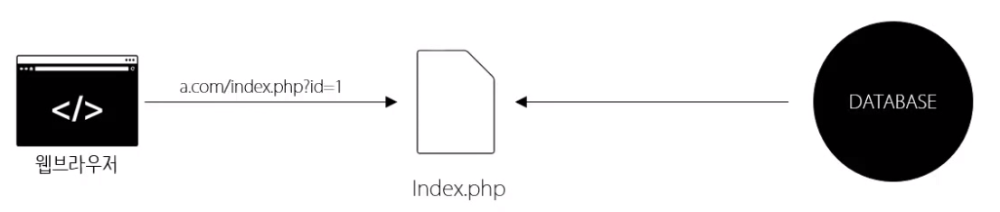

# 2주차 - 웹 어플리케이션 만들기 수업자료


## 자바스크립트 실습
- 화면의 색을 바꿔주는 버튼!
- JavaScript는 HTML을 프로그래밍적으로 제어한다.
- 단일 태그인 경우 끝에 닫는태그 대신 여는태그 마지막에 /를 추가해도 된다.
- ```<intput type="입력할 방식" value="값" />```
- 사용자가 웹 어플리케이션에 정보를 입력 할 수 있는 장치
- type에 따라서 정보를 입력하는 방식이 달라진다.
- ```alert('문자열')```
- 설정한 문자열을 띄우며 경고창을 띄우는 js 함수.

#### JavaSciprt 이벤트
```
<input type="button" value="white" onclick="alert('Hello, World!')" />
```
- js의 코드는 script 내부 뿐 아니라 html 태그 안에서도 작성 가능하다.
- html파서는 onclick을 보면 해당 element를 클릭했을 때 값으로 설정된 자바스크립트 코드를 실행하도록 설정해 놓는다.
- 이러한 것을 이벤트 프로그래밍이라고 한다.
- 여러가지 사건(이벤트)을 통해서 어떠한 코드가 실행되어야 한다는 것을 브라우저에게 명령해 놓는다.
- 이러한 이벤트 속성들은 여러가지가 있으며, 이 속성들의 값은 자바스크립트의 코드이다.

```
<input type="text" id="user_input" />
<input type="button" value="white" onclick="alert(document.getElementById('user_input').value)" />
```
- ```document.getElementById('태그의 id 속성의 값')```
- id 속성의 값을 통해서 원하는 HTML 요소를 가져올 때 사용.

- class 속성
- 태그들을 그룹핑 할 수 있다.
- 선택자는 ```. ``` 이다. (ex. ```.em { ... }```)

#### JavaScript는 HTML을 제어하는 언어
```
<input type="button" value="강조" onclick="document.getElementById('target').className='em'" />
```
- ```document.getElementById('target')``` 를 사용하여 해당 요소를 얻고, ```.className='em'```을 통해서 class 값을 지정.

```
<input type="button" value="white" onclick="document.getElementById('target').className='white'">
<input type="button" value="black" onclick="document.getElementById('target').className='black'">
```

#### JavaScript는 HTML을 제어할 수 있다.

- div 태그 : 특정 태그들을 묶을 때 사용
- js를 밖으로 빼내기
- ```<script src="js파일의 주소"></script>```


----------------------------


## PHP 실습


- 정보들을 이제는 HTML이 아닌 FILE에 저장한다.
1. 웹 브라우저가 웹서버에게 요청하면
2. 웹 서버는 PHP에게 요청한다.
3. PHP는 우리가 작성한 코드에서 **파일을 읽어오는 기능**을 수행한다.
4. 파일의 정보를 결합하고 이를 웹서버에게 건낸다.
5. 웹서버는 해당 파일을 웹 브라우저에게 응답한다.

- 이전에는 각 정보(주소)마다 HTML을 하나씩 가지고 있었다.
- 특정부분을 수정하게 되면 모든 HTML파일을 수정해야 했다.
- 즉, 중복이 존재했다.

- 이제는 PHP파일을 하나만 사용한다. 그리고 정보들은 따로 빼둔다.
- PHP파일은 사용자가 입력한 파라미터를 통해서 필요한 정보를 가져온 후 결과를 만들고 이를 보여준다.


- 하지만 파일에 데이터를 저장하는 것은 좋은 방법이 아니다
- 우리는 최종적으로 데이터베이스를 쓸 것이다.



### PHP로 파라미터 받아오기
- url : http://.../1.php?name=egoing&id=1&age=20
- 주소와 값의 구분 : ```?```
- 값과 값의 구분 : ```&```
```
<?php
echo $_GET['id'];
?>
```

### PHP로 파일 읽어오기
- file_get_contents 함수 사용
```
file_get_contents("읽으려는 파일의 path")
file_get_contents("1.txt")
file_get_contents($_GET['id'].'txt')
```

- echo 이후 태그가 와도 웹 브라우저는 HTML 코드로 인식하기 때문에 상관없다.
- 값이 있는지 확인하는 함수 : empty

```
<?php
    if( empty($_GET['id']) == false ) {
        echo file_get_contents('./txt/'.$_GET['id'].'.txt');
    }
?>
```

- 이제는 HTML과 정보를 분리시킨 것이다.
- 이렇게 분리를 통해 중복을 제거하면, 하나의 파일을 수정하면 모든 페이지에 수정된 것이 적용된다.


----------------------------

## 데이터베이스(MySQL) 이론

- 데이터베이스 : 정보를 관리하는 전문적인 에플리케이션
- HTML에서도 가장 중요한 것은 정보
- 정보가 위치하는 곳이 정말 중요한데, 근대의 웹 어플리케이션은 데이터베이스에 정보가 저장된다.
- 정보를 안전하게 보관할 수 있다.

| FILE | DATABASE|
| :-: | :-: |
| 가장 기본적이고 원시적인 형태의 데이터 관리수단 |정보를 관리하는 전문적인 수단 |
| 어느 시스템에서나 쓸수 있고 이해하기 쉽다. | 어플리케이션을 설치하고 공부도 해야한다. |

- 하지만 DATABASE를 쓴다.
- 안전하다 : 누군가가 정보를 무단으로 보지 못한다. 시스템이 고장났을 때 백업하는 시스템을 갖췄다.
- 빠르다 : 인덱스(색인)를 통해 정보를 빠르게 찾을 수 있도록 정리되어 있다.
- 프로그래밍적 제어가 가능하다.


#### MySQL
- 관계형 데이터 베이스
- WEB과 밀접한 관계, opne source를 통해 개발되었다.
- MariaDB와 호환성이 좋다.
- 구조화 (Structured)
- 표(table)

#### SQL
- Structured Query Language
- 컴퓨터에게 구조화된 정보를 질의하는 프로그래밍 언어


- SQL문을 통해 질의하고 이에 해당하는 정보(표)를 클라이언트에게 전송한다.


#### 데이터베이스 역시 Server와 Client가 존재한다.

#### MySQL monitor
- MySQL의 표준적인 클라이언트
- 데이터베이스 서버가 동작하는 모습을 투명하게 보여준다.


1. 윈도우 : cmd를 통해 MySQL monitor 사용
2. 맥 & 리눅스 : 터미널을 통해 MySQL monitor 사용


- Bitnami의 폴더 안의 mysql > bin 폴더 안에 mysql이라는 응용프로그램을 실행시킨다.
```
mysql -hlocalhost -uroot -p
```
- mysql 프로그램을 실행
- -hlocalhost : 호스트(서버)의 주소는 localhost
- -uroot : 유저는 root
- -p : 비밀번호 입력방식


- DATABASE : 테이블을 묶어주는 일종의 디렉토리
- Table : 정보를 모아놓는 일종의 파일

- 데이터베이스 보기
- ```show databases;```
- 데이터베이스 생성
- ```CREATE DATABASE opentutorials CHARACTER SET utf8 COLLATE utf8_general_ci;```
- 데이터베이스 선택
- ```use opentutorials;```
- 테이블 생성
- 각 데이터의 칼럼마다 자료형을 강제함으로써 믿고 정보를 쓸 수 있도록 한다.
- AUTO_INCREMENT : 값을 따로 입력하지 않아도 행이 입력할 때 마다 값이 1씩 증가되며 자동으로 추가된다.
```
CREATE TABLE `topic` (
`id` int(11) NOT NULL AUTO_INCREMENT,
`title` varchar(100) NOT NULL,
`description` text NOT NULL,
`author` varchar(30) NOT NULL,
`created` datetime NOT NULL,
PRIMARY KEY (id)
) ENGINE=InnoDB DEFAULT CHARSET=utf8;
```
- 테이블 보기
- ```show tables;```
- 데이터 삽입 (행 추가)
- ```INSERT INTO 테이블명 (컬럼들) VALUES (값들)```
- 문자를 입력할 땐 ``` ' ``` 컬럼이나 테이블의 이름을 쓸때는 ``` ` ```를 사용한다.
- 데이터 찾기
- ```SELECT 컬럼들 FROM 테이블명```
- ```SELECT 컬럼들 FROM 테이블명 WHERE 조건```
> 조건에 맞는 데이터만 준다.
- ```SELECT 컬럼들 FROM 테이블명 ORDER BY 칼럼 DESC```
> 정해둔 칼럼에서 오름차순으로 정렬후 데이터를 준다.
- 끝에 \G를 붙여주면

----------------------------

## MySQL 실습

- PHP가 중계자 역할을 한다고하여 미들웨어라고 부르기도 한다.
- PHP의 API인 mysqli를 사용한다.
- error.log를 통해서 어디서 에러가 났는지 확인할 수 있다.

```
<?php

?>
```

| | Mysql monitor | mysqli
|:-:|:-:|:-:|
|서버 접속 | ```mysql -hlocalhost -uroot -p111111``` | ```$conn=mysqli_connect('localhost','root','111111');```|
|DB선택 | ```use op;``` | ```mysqli_select_db($conn, op')``` |
|조회 | ```SELECT * FROM topic``` | ```$result = mysqli_query($conn, 'SELECT * FROM topic')``` |
|출력 | | ```$row = mysqli_fetch_assoc($result);``` |


#### 연관배열 (Associative Array)
```
$a = array("title"=>"JS", "desc"=>"JS is ...");

$row = mysqli_fetch_assoc($result);
```
- 각 값에 이름을 줘서 배열을 생성하는 것.
- ```mysqli_fetch_assoc```함수 는 조회한 테이블의 첫번째 값만 받아서 연관배열로 반환한다.
- 이를 두번 실행하면 결과의 두번째 행을 출력한다.

### PHP에서 MySQL 사용하기
```
<?php
$conn = mysqli_connect('localhost', 'root', '111111');
mysqli_select_db($conn, 'op');
$result = mysqli_query($conn, "SELECT * FROM topic");

while($row = mysqli_fetch_assoc($result)){
    echo '<li><a href="http://localhost/index.php?id='.$row['id'].'">'.$row['title'].'</a></li>\n'
}

if(empty($_GET['id']) === false ) {
    $sql = 'SELECT * FROM topic WHERE id='.$_GET['id'];
    $result = mysqli_query($conn, $sql);
    $row = mysqli_fetch_assoc($result);
    echo '<h2>'.$row['title'].'</h2>';
    echo $row['description'];
}
?>
```
- 가져올 데이터에 맞는 sql문을 짜고 이를 통해서 얻어온 값을 php를 사용하여 나타낸다.

### 글 작성페이지 생성
- form : 사용자가 입력한 정보를 서버로 전송되도록 하는 태그
- 어디로 보내야 할지(action 속성) 어떤 방식으로 보내야 할지(method 속성) 정한다.
- 짧은 글은 input태그의 type=text, 긴글은 textarea 태그를 사용한다. (속성이 아니다.)

- 서버로 전송하는 url은 길이의 제한이 있기 때문에 긴 정보는 url 입력방식(GET)으론 전송할 수 없다.
- POST 방식을 사용한다!
- POST 방식을 사용하면 데이터를 받을 때 ```$_POST['값의 이름']```을 사용한다.

- MySQL의 now()함수를 사용하여 현재시간 기록 가능
- Redirection : 다른 페이지로 이동시켜 준다.
- ```header('Location: http://localhost/index.php');```


----------------------------

## 관계형 데이터베이스 이론
- Relational
- 서로 다른 테이블들이 관계를 맺으며 이어짐
- DB안의 내용이 중복으로 등장할때 이러한 중복을 없애야 한다.
- 저자의 정보를 밖으로 빼내고 이를 JOIN을 사용하여 필요할때 결합한다.


```
SELECT title, name FROM topic LEFT JOIN user ON topic.author = user.id
```
- ```topic LEFT JOIN user``` : topic 테이블과 user 테이블을 결합
- LEFT : 왼쪽의 테이블을 바탕으로 부족한 정보를 결합해라
- ```ON topic.author = user.id``` : topic.author과 user.id가 같게한다.


----------------------------

## 관계형 데이터베이스 실습
### 데이터 조회
```
$sql = "SELECT topic.id,title,name,description FROM topic LEFT JOIN user ON topic.author = user.id WHERE
topic.id=".$_GET['id'];
```

### 데이터 추가
- 2개의 테이블을 사용하여 데이터를 추가해야 한다.
1. author의 데이터가 user 테이블에 있는지 확인한다.
2. 있다면 user 테이블에서 해당 사용자를 찾아서 id값을 가져와야 한다.
3. 없다면 user 테이블에 해당 데이터를 추가하고, 해당 id 값을 가져와야한다.
4. 가져온 값들을 활용해서 topic 테이블에 값을 넣는다.

```
$sql = "SELECT * FROM user WHERE name='".$_POST['author']."'";
$result = mysqli_query($conn, $sql);
if($result->num_rows == 0){
$sql = "INSERT INTO user (name, password) VALUES('".$_POST['author']."', '111111')";
mysqli_query($conn, $sql);
$user_id = mysqli_insert_id($conn);
} else {
$row = mysqli_fetch_assoc($result);
$user_id = $row['id'];
}
$sql = "INSERT INTO topic (title,description,author,created) VALUES('".$_POST['title']."', '".$_POST['description']."',
'".$user_id."', now())";
$result = mysqli_query($conn, $sql);
```

- myslqi_insert_id : 입력된 값의 primary key 값을 가져욘다. (여기선 id)

### 파일 업로드 기능 추가
- [UPLOADCARE](http://uploadcare.grsm.io/e/1Xl) 사용
```
        <p>본문 : <textarea name="description" id="description"></textarea></p>
        <input type="hidden" role="uploadcare-uploader" />
        <input type="submit" name="name"> <input type="submit" name="name">
    </form>
</article>
<script>
    UPLOADCARE_PUBLIC_KEY = "56e94eff3f72731a45d5";
</script>
<script charset="utf-8" src="//ucarecdn.com/libs/widget/2.10.3/uploadcare.full.min.js"></script>
<script>
    var singleWidget = uploadcare.SingleWidget('[role=uploadcare-uploader]');
    singleWidget.onUploadComplete(function (info) {
        document.getElementById('description').value = document.getElementById('description').value +'';
    })
</script>
```

----------------------------

## 보안
- 데이터는 잃어버리면 복구하기 매우 힘들거나 불가능하다.
- 데이터가 있는 곳은 바로 서버!
    - 서버에 접속할땐 신중하게 행동!
- 최고의 보안 담당자는 우리 시스템에 침입한 크래커
- 보안적으로 좋은 습관을 가져야 한다.

### 사용자가 입력한 script를 무력화
- 사용자가 등록한 정보안에 스크립트 코드를 아예 입력하지 못하도록 하거나, 그렇게 입력한 정보를 html로 그대로 표현되게 한다.
- html 에서 사용되는 특수기호들을 표시하기 위해서는 각 특수기호에 매칭되어 있는 문자를 써야한다.
    - ex. ```& -> &amp ```
- ```htmlspecialchars()``` 함수를 사용한다.
```
echo htmlspecialchars('<script>alert(1);</script>')
```
- htmlspecialchars를 그냥 사용하면 우리가 의도한 HTML 코드까지 모두 string으로 인식된다.
    - ```strip_tags```를 사용한다.
    - 첫번째 인자로 태그를 지울 문자열을, 두번째 인자로 허용할 태그를 적는다.
```
echo strip_tags($row['description'], '<a><h1><h2><h3><h4><h5><ul><ol><li>');
```

### SQL injection 방지

- 응용 프로그램 보안 상의 허점을 의도적으로 이용해, 악의적인 SQL문을 실행되게 함으로써 데이터베이스를 비정상적으로 조작하는 코드 인젝션 공격 방법
- 사용자가 입력한 정보를 전부 문자열화 시킨다.
    - mysqli_real_escape_string 함수를 사용
```
$name = mysqli_real_escape_string($conn, $_GET['name']);
$password = mysqli_real_escape_string($conn, $_GET['password']);
$sql = "SELECT * FROM user WHERE name='".$name."' AND password='".$password."'";
```
----------------------------

## 라이브러리 1 (직접 만들기)
- 이때까지의 기술의 발전 방향 : 중복의 제거
    - 유지보수의 편의성
    - 코드의 감소
    - 가독성 감소를 통한 코드 장악력 향상
    - **생산성의 향상**


- 라이브러리 : 중복해서 사용되는 로직을 재사용 할 수 있도록 부품화(모듈화) 시킨 것
    - 하나 혹은 여러개의 프로젝트에서 재사용

```
require("config/config.php");
require('lib/db.php');
$conn = db_init($config["host"], $config["duser"], $config["dpw"], $config["dname"]);

---------------------------
lib/db.php

function db_init($host, $duser, $dpw, $dname){
    $conn = mysqli_connect($host, $duser, $dpw);
    mysqli_select_db($conn, $dname);
    return $conn;
}

---------------------------
config/config.php

$config = array(
    "host"=>"localhost",
    "duser"=>"root",
    "dpw"=>"111111",
    "dname"=>"opentutorials"
);
```
----------------------------

## 라이브러리 2 (타인의 것 사용하기, tb)

- 바퀴를 새로 만들지 말아라
- [twitter bootstrap](https://getbootstrap.com/)
    - 깔끔하고 보편적인 디자인을 쉽게 적용 가능
    - 화면의 크기에 따라서 모양이 달라지는 미디어 쿼리 기능.

- Grid System : 12개의 열로 이루어져 있는 그리드 시스템 제공
