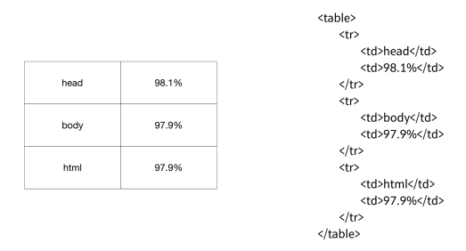

# 3주차 - WEB1 : HTML & Internet

## ~ HTML 코딩 실습 환경 준비

- 무엇인가를 만들기 전에 무엇을 만들 것인가를 미리 상상하고, 계획해보는 과정이 필요합니다. 

- 웹은 PUBLIC DOMAIN

- 필요한 에디터를 찾아내는 능력이 중요하다.

- Ctrl + O : 브라우저에서 단축키 입력시 파일열기 가능

---------------------------------

## 기본 문법 - 태그

- ```<strong> </strong>``` : 글의 중요한 부분을 진하게 표시하는 태그
- ```<u> </u>``` : 밑줄을 치는 태그


- 태그는 그것을 설명한다.
    - strong은 안의 내용이 중요하다고 이야기한다.

- 태그나 (프로그래밍) 언어를 만들 때 사람들이 일상에서 자주 쓰이는 말에서 문법을 만든다.
    - 비유, 은유가 바로 태그이다.

- ```<meta charset="utf-8">``` : 웹브라우저에게 UTF-8로 페이지를 열라고 알려주는 태그

---------------------------------

## 혁명적인 변화

- 무엇을 모르는지 알면 검색할 수 있다.
- 예제를 보며 무엇이지 추론하고 정의를 보며 확신
- ```<hn></hn>``` : 제목을 나타내는 태그 (0 < n < 7)
- 뭐가 필요한지 몰라서 모두 머리속에 넣는 시대가 아니다.
    - 검색을 통해서 자신의 원하는 답을 알아내는 것이 현명하다.
    - 무엇을 모르는지만 알고 있다면 이미 아는 것이나 다른 없는 상태

---------------------------------

## 통계에 기반한 학습

- HTML은 150개 이상의 태그가 존재하고 있다.
    - 이를 다 외우지말고 자주 사용되는 태그를 통계를 통해 알아내어 그 순서대로 공부하자.

- 보통 홈페이지는 26개 정도의 태그를 사용한다.


#### 태그별 인기도


---------------------------------

## 줄바꿈

- 검색을 해보고 자신이 원하는 것을 찾을 줄 알아야 한다.
- ```<br>``` : 줄바꿈. 닫는 태그가 없다.
- ```<p> </p>``` : 단락을 표현하는 태그. 하나의 단락을 그룹핑
#### 둘다 단락을 나누는 방법이 되지만, p태그는 이것이 단락이라는 정보도 포함하기 때문에 이를 쓰면 더 의미있는 HTML 코드가 된다.

- p태그는 정해진 여백만큼만 띄어지기 때문에 시각적으로 자유도가 떨어진다.
    - 하지만 이는 CSS로 보완할 수 있다.
    ``` <p style="margin-top:45px;"> ```


---------------------------------

## HTML이 중요한 이유

```
<h3>coding</h3>

<strong><span style="font-size:22px;">coding</span></strong>
```
- 보기에는 같아도 코드는 완전히 다르다.
### 1. 검색엔진의 관점에서 봤을 때
- 검색엔진은 태그를 보며 내용의 중요도를 결정한다.
    - 그렇다면 일반인과 지식인의 코드가 있을 때 검색엔진은 지식인의 코드를 보며 중요한 내용임을 인지하고 이를 사용자들에게 보여준다.
    - 검색엔젠이게 노출되지 않는다는 것은 실제로 존재하는냐,존재하지 않는냐의 문제
    - 웹을 만들때 HTML을 만들때 가장 중요한 것은 바로 **정보를 제대로 전달하느냐**

### 2. 접근성의 관점에서 봤을 때
- 웹이 중요하게 생각하는 접근성은 신체적인 장애가 있는 사람도 웹을 통해서 정보에 접근할 수 있어야 한다.
    - 스크린 리더 등의 프로그램으로 웹을 사용하기 때문에 의미 있는 태그를 사용하는 것이 중요하다.

---------------------------------

## 최후의 문법 속성과 img

- `````` : 이미지를 보여주는 태그
    - 하지만 태그 하나만으로는 아무런 이미지가 나타나지 않는다.
    - 새로운 문법을 추가하여 이미지를 표현하기로 하였다.


- src 속성과 width 속성을 통해서 부가정보를 제시
- 태그의 이름만으로는 정보가 부족할 때 **속성**을 통해서 더 많은 정보를 나타낼 수 있다.

---------------------------------

## 부모 자식과 목록

```
<parent>
    <child></child>
</parent>
```

- 태그들 사이의 부모 자식의 관계는 필요에 따라서 관계가 달라질 수 있습니다.
- 몇몇 태그들은 부모 자식 관계처럼 고정된 관계인 태그들이 있습니다.

#### 목록을 나타내는 태그 ```<li></li>```
- 목록은 다른 목록과 구분할 수 있도록 경계가 필요
    - ```<ul></ul>``` : unordered list
    - ```<ol></ol>``` : ordered list
    - 각각 li 태그의 부모 태그로써 존재한다.
        - li태그는 반드시 부모태그(ul 혹은 ol)를 가진다.
        - ul(혹은 ol)태그는 반드시 자식태그(li)를 가진다.

```
<ol>
    <li>HTML</li>
    <li>CSS</li>
    <li>JavaScript</li>
</ol>
```




---------------------------------

## 문서의 구조와 슈퍼스타들

### 정보가 많아짐에 따라서 정보를 잘 정리정돈하기 위한 체계, 다시 말해서 구조가 필요

- title 태그 ```<title></title>```
    - 웹 페이지의 제목을 결정시켜 준다.
    - 검색엔진이 웹페이지를 분석할 때 가장 중요하게 생각하는 태그
    - 책의 표지와 같다.

- 한글이 깨질때
    - 웹 페이지 파일을 저장할때 쓰이는 약속(인코딩 형식)은 보통 UTF-8 방식이다.
    - 그러니 웹페이지를 열 때도 UTF-8 방식으로 파일을 열어야 한다.
    - ```<meta charset="utf-8">```

#### title이나 meta와 같은 태그들은 웹 페이지의 본문을 설명하는 태그들이다.
- 이는 본문과 구별해줘야 한다.
    - 본문은 ```<body></body>``` 태그를 사용하여 감싸고
    - 본문을 설명하는 내용은 ```<head></head>``` 태그를 사용한다.
- 그리고 이러한 body와 head 태그를 감싸는 태그는 ```<html></html>```태그 이다.
- 또한 이 웹페이지가 HTML로서 만들어졌다는 것을 표현하기 위해서 문서의 시작에 ```<!doctype html>``` 태그를 추가한다.

```
<!doctype html>
<html>
<head>
    <title>WEB1 - html</title>
    <meta charset="utf-8">
</head>
<body>
    <p> ... </p>
</body>
</html>
```
### 이는 전세계 수많은 웹 페이지들이 공통적으로 가지고 있는 구조이다.

#### 공부를 하면 이렇게 눈이 밝아지고 시력이 좋아지며 예전에는 보이지 않았던 것이 보인다.


---------------------------------

## HTML 태그의 제왕

- a 태그 ```<a href="닻을 내릴 주소"></a>``
    - 태그 a는 anchor(닻)의 약자
    - 속성 href는 HyperText Reference의 약자
    - 링크를 걸게 해줘서 웹 사이트를 이동할 수 있게 해준다.

```
<a href="https://www.w3.org/TR/html5/" target="_blank" title="html5">
```

- ```target="_blank"```는 링크를 클릭했을 때 새창에서 페이지가 열리게 하는 속성
- ```title```속성은 이 링크가 어떤 내용을 담고 있는지를 툴팁으로 보여주는 기능

---------------------------------

## 웹사이트 완성

- 페이지가 모이면 책이 되듯이 웹페이지를 링크로 모으면 일종의 책이 만들어진다.
