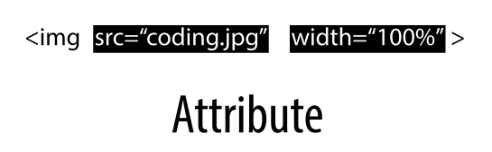
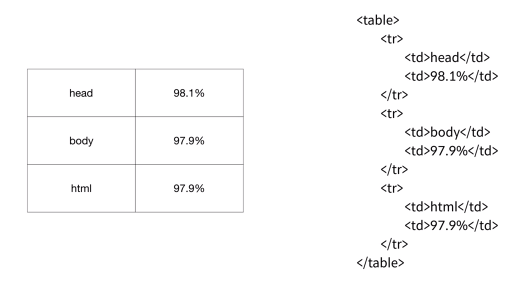

# WEB1 : HTML & Internet

## ~ HTML 코딩 실습 환경 준비

- 무엇인가를 만들기 전에 무엇을 만들 것인가를 미리 상상하고, 계획해보는 과정이 필요합니다. 

- 웹은 PUBLIC DOMAIN

- 필요한 에디터를 찾아내는 능력이 중요하다.

- Ctrl + O : 브라우저에서 단축키 입력시 파일열기 가능

---------------------------------

## 기본 문법 - 태그

- ```<strong> </strong>``` : 글의 중요한 부분을 진하게 표시하는 태그
- ```<u> </u>``` : 밑줄을 치는 태그


- 태그는 그것을 설명한다.
    - strong은 안의 내용이 중요하다고 이야기한다.

- 태그나 (프로그래밍) 언어를 만들 때 사람들이 일상에서 자주 쓰이는 말에서 문법을 만든다.
    - 비유, 은유가 바로 태그이다.

- ```<meta charset="utf-8">``` : 웹브라우저에게 UTF-8로 페이지를 열라고 알려주는 태그

---------------------------------

## 혁명적인 변화

- 무엇을 모르는지 알면 검색할 수 있다.
- 예제를 보며 무엇이지 추론하고 정의를 보며 확신
- ```<hn></hn>``` : 제목을 나타내는 태그 (0 < n < 7)
- 뭐가 필요한지 몰라서 모두 머리속에 넣는 시대가 아니다.
    - 검색을 통해서 자신의 원하는 답을 알아내는 것이 현명하다.
    - 무엇을 모르는지만 알고 있다면 이미 아는 것이나 다른 없는 상태

---------------------------------

## 통계에 기반한 학습

- HTML은 150개 이상의 태그가 존재하고 있다.
    - 이를 다 외우지말고 자주 사용되는 태그를 통계를 통해 알아내어 그 순서대로 공부하자.

- 보통 홈페이지는 26개 정도의 태그를 사용한다.


#### 태그별 인기도


---------------------------------

## 줄바꿈

- 검색을 해보고 자신이 원하는 것을 찾을 줄 알아야 한다.
- ```<br>``` : 줄바꿈. 닫는 태그가 없다.
- ```<p> </p>``` : 단락을 표현하는 태그. 하나의 단락을 그룹핑
#### 둘다 단락을 나누는 방법이 되지만, p태그는 이것이 단락이라는 정보도 포함하기 때문에 이를 쓰면 더 의미있는 HTML 코드가 된다.

- p태그는 정해진 여백만큼만 띄어지기 때문에 시각적으로 자유도가 떨어진다.
    - 하지만 이는 CSS로 보완할 수 있다.
    ``` <p style="margin-top:45px;"> ```


---------------------------------

## HTML이 중요한 이유

```
<h3>coding</h3>

<strong><span style="font-size:22px;">coding</span></strong>
```
- 보기에는 같아도 코드는 완전히 다르다.
### 1. 검색엔진의 관점에서 봤을 때
- 검색엔진은 태그를 보며 내용의 중요도를 결정한다.
    - 그렇다면 일반인과 지식인의 코드가 있을 때 검색엔진은 지식인의 코드를 보며 중요한 내용임을 인지하고 이를 사용자들에게 보여준다.
    - 검색엔젠이게 노출되지 않는다는 것은 실제로 존재하는냐,존재하지 않는냐의 문제
    - 웹을 만들때 HTML을 만들때 가장 중요한 것은 바로 **정보를 제대로 전달하느냐**

### 2. 접근성의 관점에서 봤을 때
- 웹이 중요하게 생각하는 접근성은 신체적인 장애가 있는 사람도 웹을 통해서 정보에 접근할 수 있어야 한다.
    - 스크린 리더 등의 프로그램으로 웹을 사용하기 때문에 의미 있는 태그를 사용하는 것이 중요하다.

---------------------------------

## 최후의 문법 속성과 img

- `````` : 이미지를 보여주는 태그
    - 하지만 태그 하나만으로는 아무런 이미지가 나타나지 않는다.
    - 새로운 문법을 추가하여 이미지를 표현하기로 하였다.



- src 속성과 width 속성을 통해서 부가정보를 제시
- 태그의 이름만으로는 정보가 부족할 때 **속성**을 통해서 더 많은 정보를 나타낼 수 있다.

---------------------------------

## 부모 자식과 목록

```
<parent>
    <child></child>
</parent>
```

- 태그들 사이의 부모 자식의 관계는 필요에 따라서 관계가 달라질 수 있습니다.
- 몇몇 태그들은 부모 자식 관계처럼 고정된 관계인 태그들이 있습니다.

#### 목록을 나타내는 태그 ```<li></li>```
- 목록은 다른 목록과 구분할 수 있도록 경계가 필요
    - ```<ul></ul>``` : unordered list
    - ```<ol></ol>``` : ordered list
    - 각각 li 태그의 부모 태그로써 존재한다.
        - li태그는 반드시 부모태그(ul 혹은 ol)를 가진다.
        - ul(혹은 ol)태그는 반드시 자식태그(li)를 가진다.

```
<ol>
    <li>HTML</li>
    <li>CSS</li>
    <li>JavaScript</li>
</ol>
```




---------------------------------

## 문서의 구조와 슈퍼스타들

### 정보가 많아짐에 따라서 정보를 잘 정리정돈하기 위한 체계, 다시 말해서 구조가 필요

- title 태그 ```<title></title>```
    - 웹 페이지의 제목을 결정시켜 준다.
    - 검색엔진이 웹페이지를 분석할 때 가장 중요하게 생각하는 태그
    - 책의 표지와 같다.

- 한글이 깨질때
    - 웹 페이지 파일을 저장할때 쓰이는 약속(인코딩 형식)은 보통 UTF-8 방식이다.
    - 그러니 웹페이지를 열 때도 UTF-8 방식으로 파일을 열어야 한다.
    - ```<meta charset="utf-8">```

#### title이나 meta와 같은 태그들은 웹 페이지의 본문을 설명하는 태그들이다.
- 이는 본문과 구별해줘야 한다.
    - 본문은 ```<body></body>``` 태그를 사용하여 감싸고
    - 본문을 설명하는 내용은 ```<head></head>``` 태그를 사용한다.
- 그리고 이러한 body와 head 태그를 감싸는 태그는 ```<html></html>```태그 이다.
- 또한 이 웹페이지가 HTML로서 만들어졌다는 것을 표현하기 위해서 문서의 시작에 ```<!doctype html>``` 태그를 추가한다.

```
<!doctype html>
<html>
<head>
    <title>WEB1 - html</title>
    <meta charset="utf-8">
</head>
<body>
    <p> ... </p>
</body>
</html>
```
### 이는 전세계 수많은 웹 페이지들이 공통적으로 가지고 있는 구조이다.

#### 공부를 하면 이렇게 눈이 밝아지고 시력이 좋아지며 예전에는 보이지 않았던 것이 보인다.


---------------------------------

## HTML 태그의 제왕

- a 태그 ```<a href="닻을 내릴 주소"></a>``
    - 태그 a는 anchor(닻)의 약자
    - 속성 href는 HyperText Reference의 약자
    - 링크를 걸게 해줘서 웹 사이트를 이동할 수 있게 해준다.

```
<a href="https://www.w3.org/TR/html5/" target="_blank" title="html5">
```

- ```target="_blank"```는 링크를 클릭했을 때 새창에서 페이지가 열리게 하는 속성
- ```title```속성은 이 링크가 어떤 내용을 담고 있는지를 툴팁으로 보여주는 기능

---------------------------------

## 웹사이트 완성

- 페이지가 모이면 책이 되듯이 웹페이지를 링크로 모으면 일종의 책이 만들어진다.


--------------------------------------

## 원시웹

- 우리의 또 다른 목표 내가 만든 웹페이지를 인터넷을 통해서 누구나 가져갈 수 있게 하는 것

- 웹과 인터넷은 같지 않다.


### 웹의 역사
- 정보기술 역사상 중요한 사건 2개가 1960년대와 1990년대에 있었다.
- 1960년은 인터넷이 탄생. 1990년에는 웹이 시작됩니다.
- 1960년 인터넷의 탄생
    - 1960년은 핵전쟁이 끝난 지 얼마되지 않은 때
    - 미국에서는 핵공격이 일어났을 때 통신시스템에 심각한 취약점이 있다는 것을 발견
    - 당시에는 통신 시스템이 중앙집중적이었기 때문에 핵공격을 당하면 통신이 마비되는 위험이 있었다.
    - 이런 문제를 극복하기 위해서 분산된 형태의 통신시스템을 구상하게 되는데 그것이 인터넷의 시작.
    - 수많은 통신장치가 각자 전화국 역할을 하기때문에 하나가 파괴되어도 나머지가 역할을 한다.


- 1990년 웹의 탄생
    - 스위스에는 유럽입자물리 연구소(CERN)라는 저명한 연구소가 있었다.
    - 1980년 팀 버너스 리 라는 중요한 인물이 연구소에 들어온다.
    - 그는 10년동안 연구소를 들어갔다 나왔다를 반복하며 웹의 전신이 될 프로그램을 만들었다.
    - 1990년 연구소에 인터넷이 도입되었다.
    - 인터넷이 연구소에 도입되면서 팀버너스리는 지금까지의 경험에 인터넷을 합성해서 인류사적인 의미를 갖는 작업을 조용히 시작하였다.
    - 1990년 10월. 웹페이지를 편집하는 프로그램
    - 1990년 11월. 세계 최초의 웹브라우저
        - 이 웹브라우저의 이름이 바로 월드 와이드 웹(world wide web)
    - 1990년 12월 24일 크리스마스 이브에 마침내 웹서버를 완성
        - 이 서버에 info.cern.ch라는 도메인 네임을 부여

#### 인터넷이 등장한 1960년 이후로 엘리트 시스템이었던 인터넷이 1990년 웹을 만나면서 본격적인 대중화의 길을 걷기 시작

- 팀 버너스 리가 처음으로 창조한 웹은 **원시웹**
    - 웹이기 위해서 필요한 것을 모두 가지고 있으면서 그렇지 않은 것은 배제한 순수한 상태
    - 우리는 원시웹을 만들수 있다.
    - 이제 내가 만든 웹 페이지를 인터넷을 통해서 전세계의 누구나 볼 수 있도록 해야 한다.

---------------------------------

## 인터넷을 여는 열쇠 : 서버와 클라이언트


1. 웹브라우저가 설치된 컴퓨터는 인터넷을 통해서 전기적인 신호를 info.cern.ch라는 주소의 컴퓨터에게 찌릿하고 보냅니다.
    - 그 전기적인 신호는 '나는 index.html 이라는 파일의 코드를 원합니다.'
2. info.cern.ch에 설치된 웹서버라는 프로그램이 어떤 디렉토리에서 index.html이라는 파일을 찾습니다.
3. 내용을 읽어서 전기적인 신호를 바꾼 후에 웹브라우저가 설치된 컴퓨터에 신호를 보냅니다.
4. 웹브라우저는 그 코드를 읽어서 웹페이지를 화면에 출력합니다.
5.  웹브라우저가 설치된 컴퓨터에는 index.html 파일의 내용 즉 코드가 도착합니다.


#### 서버와 클라이언트는 인터넷을 이용하는 모든 정보 시스템에 적용되는 문법.

- 웹서버에 익숙해지면 내가 만든 컨텐츠를 인터넷을 사용할 수 있는 전 세계의 누구나 사용하도록 있도록 할 수 있습니다.
    - 1 자신의 컴퓨터에 직접 웹서버를 설치 (어렵지만 많은것을 알게된다.)
    - 2 웹서버를 제공해주는 업체를 이용 (쉽지만 많은 것이 감춰져 있다.)
    - 웹호스팅으로 쉽게 목표를 달성한 후에 웹서버를 직접 설치하는 방법을 공부.

---------------------------------

## 웹호스팅 (github pages)

### [github](https://github.com)의 pages 기능

1. github 회원가입
2. 저장소(repository) 생성.
3. 파일 업로드
4. Settings > GitHub Pages 설정 > master branch 선택 > Select branch 중 master branch를 선택
5. 표시되는 주소로 접속


- static web hosting : HTML만을 지원하는 호스팅
    - HTML은 웹브라우저가 해석하기 때문에 서버쪽에서 특별히 해 줄 일이 없습니다. 이런 특성을 정적(static)이라고 합니다.

- 웹서버를 직접 운영하는 것에 비해서 웹호스팅을 이용하면 쉽다.
    - 단점은 인터넷의 원리가 감춰져 있다는 것입니다.
    - 하지만 현업에서 웹서버를 직접 운영하는 경우는 많지 않아요. 웹서버를 운영하기 위해서는 많은 노하우가 필요하거든요.

- 중요한 것은 github의 사용법이 아니고, 여러분이 필요한 웹호스팅을 찾아내는 능력.


---------------------------------

## 웹서버 운영하기

- 웹 서버는 Apache를 사용
    - 오픈소스이자 공공재

### 웹서버 운영 : 윈도우

- Bitnami WAMP Stack을 사용
    - 설치 후 C:\Bitnami\wampstack-** 디렉토리 확인
    - manager-windows 프로그램에서 Go to Application 버튼 클릭

- 아래는 전부 같은 주소
    - localhost
    - http://localhost/index.html
    - http://127.0.0.1/index.html

- index.html 파일은 내 컴퓨터 어디에 있을가?
    - Bitnami wampstack이 설치된 디렉토리에 보시면 apache → htdocs → index.html 의 파일


#### 웹서버 사용 유무의 차이점


#### 웹브라우저가 웹서버에 접속하기 위해서는 웹서버가 설치된 컴퓨터의 주소(ip 주소)를 알아야 한다.


#### 사설망을 사용하여 접속해보기


### 웹서버 운영하기 : 맥

- 맥은 이미 Apache가 설치되어 있지만, 사용의 편의를 위해 Bitnami mampstack을 설치한다.
    - 이하 동일

### 웹서버 운영 : 리눅스

- 터미널에서 아래의 명령어 입력을 통해 Apache 설치
```
sudo apt-get update
sudo apt-get install apache2
```

- 아래의 명령어를 통해서 자신의 IP 확인
```
hostname -I
```

- Apache의 기본 파일은 ```/var/www/html``` 디렉토리에 있는 ```index.html```파일이다.


---------------------------------

## 수업을 마치며

- 공부를 멈추고 공부한 것을 사용하기도 좋은 때
    - 공부만 하고 공부한 것을 사용하지 않으면 나중엔 머리 속이 너무 복잡해져서 막상 코딩을 하려니 무엇을 해야할 지 모르게 됩니다.

- 처음엔 큰 기능도 쉽게 만들어지지만 뒤로 갈수록 사소한 기능 하나를 추가하는 것도 어렵게 되면서 깊은 슬럼프에 빠지게 됩니다.
    - 공부도 마찬가지


---------------------------------

## 부록 : 코드의 힘

### 동영상 삽입

- 유튜브 등 여러 동영상 서비스의 동영상을 HTML 코드로 가져올 수 있다.
    - iframe 태그

- 타인이 만든 서비스를 손쉽게 자신의 서비스에 추가하는 것.

### 댓글 기능 추가

- Disqus를 사용.
    - 회원가입 후 새로운 웹사이트 생성
    - Universal Code를 선택 > 복사 & 붙여놓기 수정
    - 웹서버를 통해 HTML을 열어야 한다.

### 채팅 기능 추가

- tawk를 사용
    - 회원가입 후 관리자 > Widget Code를 복사 & 붙여놓기
    - 웹서버를 통해 HTML을 열어야 한다.

### 방문자 분석기

- Google Analytics 사용
    - 로그인 후 New Account
    - 계정 생성 후 Tracking Code > Global Site Tag 복사 & HEAD에 붙여놓기
- 사용자가 사용하는 언어, 위치 등의 데이터를 모을 수 있다.