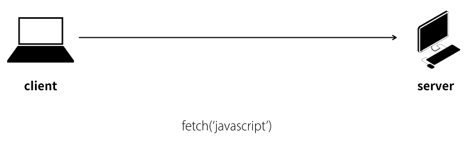

# WEB3 - Ajax

## 수업소개

- 웹 페이지의 정보를 부분적으로 변경하는 방법
    - ex. 검색엔진의 추천검색어 : 입력을 할 때 마다 서버에게 추천검색어를 받아온다.
- 전체를 다시 받아올때 문제점
    - 페이지 전체를 리로딩 하면 사용자의 관심이 분산된다.
    - 서버입장에서도 모든 페이지를 다 전송해야 되기 때문에 부담이 크다.

#### Ajax : Asynchronous Javascript And Xml

---------------------------

## 수업의 목적

- 부분적으로 페이지를 갱신할 수 있도록 해주는 것이 Ajax이다.
    - 서버와 클라이언트 모두 부담이 줄어든다.
    - 변경된 부분에만 집중할 수 있으므로 사용성이 증가된다.
    - 기본적인 부분(코드)을 재사용 할 수 있다.

#### 하나의 페이지에서 모든 정보를 보여주는 Single-page application 을 구현할 수 있다.

---------------------------

## 실습환경 준비

- WEB2 : Javascript 수업에 의존하고 있기 때문에 코드를 받아야한다.
    - [소스 다운받기](https://github.com/web-n/web2_javascript/archive/master.zip)

#### Ajax는 파일열기로 하면 보안문제상 실행되지 않는다.
- 꼭 웹 서버를 거쳐서 실행시켜야 한다.

---------------------------

## fetch API

### 기본 사용법
```
fetch('css').then(function(response){
    response.text().then(function(text){
        document.querySelector('article').innerHTML = text;
    })
})
```
1. ```fetch('***')``` 에서 원하는 파일을 요청한다.
2. ```res.text().then(function(****){ .... })```
    - 요청한 파일은 ```****```변수에 들어있다.
    - 최종적으로는 콜백함수 안의 ```....```이 실행된다.

### 요청과 응답

- ```fetch('javascript')``` : client가 server에게 javascript 파일을 요청
- 서버가 응답할때 시간이 오래 걸릴 수 있으니 ```then```을 쓴다.
    - 이는 서버의 응답이 끝나면 매개변수로 있는 함수를 실행한다.
    - 이를 사용하면 fetch를 비동기(Asynchronous)로 사용할 수 있다.
```
function callbackme(){
    console.log('response end');
}
fetch('html').then(callbackme);
```

### response 객체

#### 익명함수
- 이름이 없는 함수. 다른곳에서 쓰이지 않는다면 이름을 주지 않는다.
    - ```function(){}```
    - ```function callbackme(){}```와 ```callbackme = function(){}```은 똑같은 코드이다.
        - 따라서 ```function(){}```을  then의 인자로 전달해 줄 수 있다.
```
fetch('css').then(function(){
    ...
})
```

- 사용설명서를 보면 ```fetch('html').then()```의 콜백함수의 첫번째 인자에 response 객체를 준다고 되어있다.
    - ```fetch('css').then(function(response){})```

#### 응답코드
- response 객체의 status을 통해 응답이 제대로 왔는지 확인할 수 있다.
    - 200 : 정상 응답
    - 404 : 파일이 없는 경우
```
fetch('html').then(function(response){
    if(response.status == '404'){
        //경고
    }
})
```

---------------------------

## Ajax의 적용

```
function fetchPage(name){
    fetch(name).then(function(response){
        response.text().then(function(text){
            document.querySelector('article').innerHTML = text;
        })
    });
}
```

```
<ol>
    <li><a onclick="fetchPage('html')">HTML</a></li>
    <li><a onclick="fetchPage('css')">CSS</a></li>
    <li><a onclick="fetchPage('javascript')">JavaScript</a></li>
</ol>
<article>

</article>
```

---------------------------

## 초기 페이지 구현

### 해시링크 (앵커)
- 하나의 페이지 안에서 다른 곳으로 이동하기 위한 링크
    1. 이동하고자 하는 곳에 id값을 준다.
        - ```<p id="three">...</p>```
        - 해당 내용을 **fragment** 라고 한다. (...에 해당되는 부분)
        - 해당 내용을 식별하는 id는 **fragment identifier** (여기서는 three)
    2. a태그의 href 값으로 ```#id값```을 준다.
        - ```<a href="#three">three</a>```
- 이를 통해 링크를 통한 ajax 페이지 로딩을 구현할 수 있다.
    - 해당 페이지의 hash 값을 알아야한다. (```#```뒤의 값)
    - ```location.hash```를 통해 알 수 있다.
    - 이때 #까지 출력되니(ex. #three) ```substr```함수를 사용하여 앞부분을 자른다.
    - ```location.hash.substr(1)```

```
if(location.hash) {
    console.log(location.hash.substr(1));
} else {
    // Fragment doesn't exist
}
```

### 적용

- 해시는 기본적으로 북마크 기능이기 때문에 구분을 위해 ```#!value```처럼 ```!```를 붙인다.
    - 이를 해시뱅이라고도 부른다.
    - 이러면 ```substr(2)```를 사용해야 한다.

```
<h1><a href="#!welcome">WEB</a></h1>
<ol id="nav">
    <li><a href="#!html" onclick="fetchPage('html')">html</a></li>
    <li><a href="#!css" onclick="fetchPage('css')">css</a></li>
    <li><a href="#!javascript" onclick="fetchPage('javascript')">javascript</a></li>
</ol>
```

```
if(location.hash){
    fetchPage(location.hash.substr(2));
} else {
    fetchPage('welcome');
}
```

#### 이렇게 할 경우 검색엔진 최적화가 되어 있지 않다.
- 데이터를 서버에서 동적으로 가져오기 때문
- 웹 브라우저의 네비게이션(앞으로 가기, 뒤로가기) 기능을 사용했을 때 페이지가 바뀌지 않는다.
    - 요즘에는 이러한 단점을 때문에 pjax를 사용한다.
        - pjax는 새로운 기술이 아닌, 기존 기술 보완한 진화된 방식.

---------------------------

## 글목록 ajax로 구현하기

- ```split('')``` : 특정구분자를 통해 문자열을 잘라서 배열로 생성한다.
- 문자열 안에서 작은 따옴표(혹은 큰 따옴표)를 구현하기 위해서는 ``` \' ```(혹은 ```\"```)을 사용한다.
- 줄바꿈이 있을 수 있기 때문에 ```trim()```함수를 사용한다. (양 옆의 공백을 지워준다.)


```
fetch('list').then(function(response){
    response.text().then(function(text){
        var items = text.split(',');
        var tags = '';
        for(var i=0; i<items.length; i++){
            var item = items[i].trim();
            var tag = '<li><a href="#!'+item+'" onclick="fetchPage(\''+item+'\')">'+item+'</a></li>';
            tags = tags + tag;
        }
        document.querySelector('#nav').innerHTML = tags;
    })
});
```


---------------------------

## fetch API polyfill

- 기존에는 ```XMLHttpRequest```를 사용했지만, 현재는 더 강력한 ```Fetch```를 사용한다.
    - 다만 이는 최신기술이기 때문에 브라우저 호완성 문제가 있을 수 있다.
    - 이를 해결해주는 것이 **polyfill**이다.
    - fetch를 지원되지 않는 브라우저에서 코드가 실행되면 polyfill 이 활성화되서 대신 동작한다.

#### polyfill : 예전 버전의 브라우저를 쓰는 사람들도 기능을 사용할 수 있도록 도와주는 것

- [fetch polyfill](https://github.com/github/fetch)
    - 다운로드를 받는다. [바로 다운받기](https://github.com/github/fetch/archive/master.zip)
- 그 후 ```fetch.js```파일을 사용하면 된다.
    - ```<script src="fetch.js가 있는 경로"></script>```
    - fetch가 지원되는 최근 버전의 브라우저라면 ```fetch.js```파일은 다운(응답)만 되고 실행되지 않는다.
- 혹은 CDN을 사용할 수도 있다. 아래의 두줄을 추가하면 된다.
```
<script src=https://cdn.jsdelivr.net/npm/promise-polyfill@8.1/dist/polyfill.min.js></script>
<script src=https://cdn.jsdelivr.net/npm/whatwg-fetch@3.0/dist/fetch.umd.min.js></script>
```

---------------------------

## 수업을 마치며

- ajax를 통해 웹은 문서를 넘어서서 어플리케이션으로 나아갈 수 있었다.

- 앞으로 공부를 위한 키워드
    - XML : 데이터를 저장할 수 있는 양식
    - JSON : XML과 비슷하지만 간결하며 다른 언어에서도 사용하기 쉽다.
    - Single Page Application(SPA)
        - PJAX(pushState | ajax) : ajax의 단점을 보완
        - Progressive Web Apps : SPA를 기반으로 만들어진 웹에 offline에서도 동작하는 특성을 추가. online + offline의 장점을 모두 가진다.