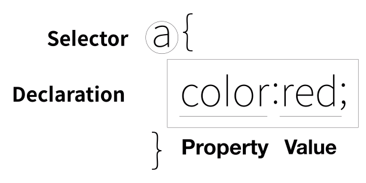

# WEB2 : CSS

- [WEB2 : CSS](#web2--css)
  - [수업](#%ec%88%98%ec%97%85)
  - [CSS 등장 이전의 상황](#css-%eb%93%b1%ec%9e%a5-%ec%9d%b4%ec%a0%84%ec%9d%98-%ec%83%81%ed%99%a9)
  - [CSS의 등장](#css%ec%9d%98-%eb%93%b1%ec%9e%a5)
  - [혁명적 변화](#%ed%98%81%eb%aa%85%ec%a0%81-%eb%b3%80%ed%99%94)
  - [CSS 속성을 스스로 알아내는 방법](#css-%ec%86%8d%ec%84%b1%ec%9d%84-%ec%8a%a4%ec%8a%a4%eb%a1%9c-%ec%95%8c%ec%95%84%eb%82%b4%eb%8a%94-%eb%b0%a9%eb%b2%95)
  - [CSS 선택자를 스스로 알아내는 방법](#css-%ec%84%a0%ed%83%9d%ec%9e%90%eb%a5%bc-%ec%8a%a4%ec%8a%a4%eb%a1%9c-%ec%95%8c%ec%95%84%eb%82%b4%eb%8a%94-%eb%b0%a9%eb%b2%95)
      - [우선순위](#%ec%9a%b0%ec%84%a0%ec%88%9c%ec%9c%84)
      - [검색시 CSS selectors](#%ea%b2%80%ec%83%89%ec%8b%9c-css-selectors)
  - [박스모델](#%eb%b0%95%ec%8a%a4%eb%aa%a8%eb%8d%b8)
      - [block, inline](#block-inline)
      - [박스모델](#%eb%b0%95%ec%8a%a4%eb%aa%a8%eb%8d%b8-1)
      - [크롬 개발자 도구를 통해 width, padding, margin을 쉽게 확인할 수 있다.](#%ed%81%ac%eb%a1%ac-%ea%b0%9c%eb%b0%9c%ec%9e%90-%eb%8f%84%ea%b5%ac%eb%a5%bc-%ed%86%b5%ed%95%b4-width-padding-margin%ec%9d%84-%ec%89%bd%ea%b2%8c-%ed%99%95%ec%9d%b8%ed%95%a0-%ec%88%98-%ec%9e%88%eb%8b%a4)
  - [그리드](#%ea%b7%b8%eb%a6%ac%eb%93%9c)
      - [디자인을 위해 존재하는 태그](#%eb%94%94%ec%9e%90%ec%9d%b8%ec%9d%84-%ec%9c%84%ed%95%b4-%ec%a1%b4%ec%9e%ac%ed%95%98%eb%8a%94-%ed%83%9c%ea%b7%b8)
    - [grid 시스템](#grid-%ec%8b%9c%ec%8a%a4%ed%85%9c)
  - [반응형 디자인](#%eb%b0%98%ec%9d%91%ed%98%95-%eb%94%94%ec%9e%90%ec%9d%b8)
  - [CSS 코드의 재사용](#css-%ec%bd%94%eb%93%9c%ec%9d%98-%ec%9e%ac%ec%82%ac%ec%9a%a9)
  - [수업을 마치며](#%ec%88%98%ec%97%85%ec%9d%84-%eb%a7%88%ec%b9%98%eb%a9%b0)

## 수업

- CSS의 기본 문법 (선택자와 속성)
- Grid를 이용한 현대적인 레이아웃 제작 방법
- MediaQuery를 이용해서 다양한 크기의 스크린에 대응하는 방법


## CSS 등장 이전의 상황

- 디자인을 해주는 HTML 태그
    - ```<font></font>``` : 문자에 색을 바꾸는 태그
    - 정보는 아무것도 없다. 오직 디자인 자체만 담당
    - HTML의 정보적 가치가 떨어지는 문제 발생
    - 유지 보수하기 힘들다.

-----------------------------

## CSS의 등장

- 웹 브라우저에게 CSS를 쓸 것임을 말해줘야 한다.
    - ```<style></style>``` : 태그 내부의 코드는 CSS 코드임을 말해준다.

- CSS 사용시 코드의 중복이 제거되고 유지보수가 쉬워진다.
    - HTML으로 웹페이지를 디자인 하는 것 보다 훨씬 효과적이다.
    - HTML에 디자인 관련코드가 없으므로 정보로써의 가치가 유지된다.

-----------------------------

## 혁명적 변화

- CSS 코드를 추가하는 방법
    1.  ```<style></style>``` 태그 내부에 추가
        - 선택자를 사용.
    2. HTML 태그에 ```style```속성의 값으로 추가
        - ```<li style="color:red">CSS</li>```

- 효과를 지정한 다음에는 세미콜론```;```을 추가해 줘야한다.



-----------------------------

## CSS 속성을 스스로 알아내는 방법

- property : 속성. 효과.

- 추천검색어 : CSS text size property
    - ```font-size``` : 문자의 크기를 바꾸는 속성

- CSS text center property
    - ```text-align``` : 문자를 정렬하는 속성
        - 속성 값으로 left, right, center 가능

- 검색을 하거나 혹은 에디터의 도움을 받으며 코딩하면 된다. 

-----------------------------

## CSS 선택자를 스스로 알아내는 방법

- class 속성 : 태그에 ```class="value"```를 주면 여러 태그를 하나의 class로 묶을 수 있다.
    - CSS에서 쓰기위해선 ```.```을 붙여서 ```.value { }```이런식으로 사용한다.
    - class의 값은 여러개를 줄 수 있고, 띄어쓰기로 구분한다.
    

- id 속성 : 태그에 ```id="value"```를 주면 특정 태그를 선택 할 수 있다.
    - CSS에서 쓰기위해선 ```#```을 붙여서 ```#value { }```이런식으로 사용한다.

#### 우선순위
- tag < class < id
    - id의 값은 단 한번만 등장해야 한다.(중복되어선 안된다.)
    - 구체적인 것이 포괄적인것 보다 우선순위가 높다.
- 같은 계층의 선택자일 경우 보다 나중에 나온 명령이 효력을 갖는다.

#### 검색시 CSS selectors
[W3C CSS Selectors Reference](https://www.w3schools.com/cssref/css_selectors.asp)

[반드시 기억해야 하는 CSS 선택자 30개](https://code.tutsplus.com/ko/tutorials/the-30-css-selectors-you-must-memorize--net-16048)


-----------------------------

## 박스모델

#### block, inline
- 태그의 성격과 쓰임에 따라서 차지하는 공간이 다르다.
    - block : 화면 옆 전체를 차지
    - inline : 자신의 컨텐츠 크기만큼만 차지
    - ```display```속성을 사용하여 이 성격을 바꿀 수 있다.
        - inline, block, none 등을 값으로 사용

- 여러 선택자를 선택하기 위해선 ```,```를 사용한다.
- ```border``` 속성 : 테두리 굵기, 테두리 종류, 테두리 색을 순서대로 값으로 입력
    - ```border : 5px solid red;```

#### 박스모델
- ```width``` : 컨텐츠의 가로 길이
- ```height``` : 컨텐츠의 세로 길이
- ```padding``` : 컨텐츠와 테두리 사이의 간격
- ```margin``` : 테두리와 테두리 사이의 간격

#### 크롬 개발자 도구를 통해 width, padding, margin을 쉽게 확인할 수 있다.


-----------------------------

## 그리드

#### 디자인을 위해 존재하는 태그
- ```<div></div>``` : block level 태그
- ```<span></span>``` : inline level 태그

### grid 시스템
1. 2개(이상)의 div를 감싸는 하나의 div태그(id="grid")를 만든다.
2. #grid의 display 속성을 ```grid```로 준다.
3. ```grid-template-columns``` 속성을 사용한다.
    - 각 칼럼의 넓이를 지정해준다.
    - fr 단위는 전체 공간 중 사용하고 남은 나머지 공간에서의 비율을 뜻한다.

```
<style>
    #grid{
        border:5px solid pink;
        display:grid;
        grid-template-columns: 150px 1fr;
    }
</style>

...

<div id="grid">
    <div>NAVIGATION</div>
    <div>Lorem</div>
</div>
```

[Can I use](https://caniuse.com/)

-----------------------------

## 반응형 디자인

- 반응형 디자인 : 화면의 크기에 따라 웹페이지의 각 요소들이 반응하여 최적화된 모양이 되는것.

- 미디어 쿼리 : 반응형 디자인을 할 수 있는 기능
    - 화면의 크기 및 특성에 따라서, 특정 조건을 만족할 때만 CSS를 적용시킬 수 있다.
```
<style>
    @media(max-width:800px){
        div{
                display:none;
            }
    }
</style>
```

-----------------------------

## CSS 코드의 재사용

- 하나의 CSS 코드를 중복으로 사용하기 위해서 CSS 코드를 별도의 파일로 빼 놓는다.
    - 해당 CSS 파일을 포함시키는 태그가 ```<link>```태그이다.
    - ```<link rel="stylesheet" href="style.css">```

- 사용성이 높아진다.
- 유지보수가 쉬워진다.
- 코드 전체의 양이 줄어들었다.(중복 제거)

-----------------------------

## 수업을 마치며

- 속성을 많이 알수록 더 많은 종류의 디자인을 만들 수 있고 선택자를 많이 알수록 더 정확하게 디자인을 적용할 수 있다.