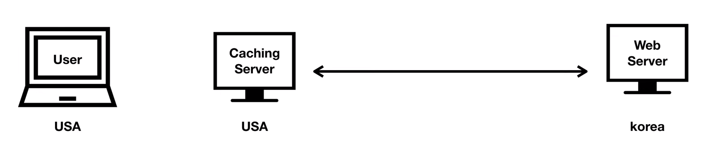

# WEB2 - HTTP Cache

## 수업소개

- HTTP의 CACHE에 대한 수업.
- Cache는 저장하는 것.
    - 데이터의 전송 속도를 높이기 위해 고안됨.
    - 이미 다운로드 받은 파일은 다시 받지 않고 컴퓨터에 저장되어 있는 캐시를 사용한다.
- 하지만 사용자가 Cache를 사용하고 있다면, 사용자가 과거의 웹 페이지를 볼 수 도 있다.
    - Cache를 최신상태로 유지하기는 힘들다.

- 캐시를 만드는 법과 섬세히 다루는 법을 배운다.
    - 최신 상태를 유지하는 웹의 장점과 바로바로 실행되는(performance가 좋은) 앱의 장점을 모두 갖춘 웹 어플리케이션을 만들 수 있다.

----------------------------
## 수업 준비

1. 통신 방법을 매우 느리게 한다.
    - 개발자 도구 > 네트워크 > Online를 눌러서 Slow 3G로 변경한다.
2. 캐시 설정을 위해 웹 서버의 설정을 바꾼다. 
    - 아파치의 경우 httpd.conf 파일을 연다.
        - bitnami WAMP Stack > Manage Servers > Apache 클릭 > Configure > Open Conf File > Yes
    - 파일의 제일 끝에 캐시의 설정을 추가한다.

----------------------------
## 캐시를 금지하는 법 - Cache-Control: no-store

- 아파치 설정파일(httpd.conf)에 아래의 설정을 추가한다.
```
SetEnv no-gzip 1
Header set Cache-Control "no-store"
```
1. 아파치의 파일 압축기능이 캐시에 영향을 주기 때문에 임시로 끈것.
2. Header를 설정한다. 파일이 요청되어서 응답할때 ```Cache-Control```헤더를 추가하고 ```"no-store"``` 값을 보내라.
    - 이 설정은 HTTP1.1 표준에 정의되어 있다.

----------------------------
## 캐시를 사용하는 법 - Cache-Control: maxAge

### Expiration (만료)
- 캐시를 생성한 다음 언제까지 쓸 것인지 만료일(수명)을 지정
    - ```Cache-Control : max-age=31636000```
    - 초 단위
```
실제 설정 파일에선
Header set Cache-Control "max-age=31636000"
```

#### 다만 이렇게 캐시를 적용했을 때는 신선도의 문제가 생긴다.
- 새로운 내용으로 바뀌어도 캐시에 저장된 데이터를 불러온다.
    - 사용자는 과거의 페이지를 보게된다.

### 문제점 해결
- ```Cache-Control : max-age=5```로 설정하면 5초 후에 서버에 접속시 데이터를 다시 다운로드 받는다.
    - 하지만 실제로 다운받는 데이터는 실제 데이터 크기보다 훨씬 작다. 즉 소량의 통신만 한다.
    - 이때 파일을 수정하면 서버에서 실제 해당 데이터를 다운로드 받는다. 

### 해결의 이유
- Response Header에 있는 ```Last-Modified```는 해당 파일이 마지막으로 수정된 시간이 기록되어 있다.
    - 웹 브라우저는 해당 파일을 캐시에 저장할 때 ```Last-Modified```도 같이 저장한다.
    - 그 후 5초가 지나면 해당 캐시파일을 버리는게 아니고, 요청을 할때 브라우저가 웹 서버에게, 해당 파일이 ```Last-Modified``` 이후로 수정된 적 있는지 물어본다.
        - 있다면 내용을 전송해준다.
        - 없다면 내용을 전송하지 않고 수정된적이 없다고만 말해준다.
            - status code : 304 (Not Modified)

#### 즉, 캐시의 유효기간이 끝나도 해당 파일이 서버에서 수정되지 않는다면 용량이 작은 헤더끼리만 통신을 하기 때문에 캐시를 사용할 수 있다.
- 항상 헤더로 확인하고 싶다면 아래의 설정 둘 중 하나를 쓰면된다.
    - 이는 캐시를 저장하지 않는게 아니라, 캐시가 유효한지 항상 확인하는 것이다.
```
Cache-Control : max-age=0
Cache-Control : no-cache
```

----------------------------

## ETag

- 컴퓨터에선 1초에 수천번의 연산이 이루어 지기 때문에 ```Last-Modified```에는 초까지만 나와 있기 때문에 부정확할 가능성이 있다.
    - 이 상황에서 **ETag**를 사용한다.

#### ETag에는 ```b0f-57b3cb49d1180```과 같은 알수 없는 정보가 적혀 있다.
- 웹 브라우저는 웹 서버가 알려준 ETag 정보와 데이터를 함께 캐시에 저장한다. 
    - 이후 요청시 캐시에 저장된 파일의 ETag와 서버의 ETag가 맞는지 확인하기 위해 ```If-None-Match```라는 헤더를 보낸다.
        - ```If-None-Match : "b0f-57b3cb49d1180"```
    - 이때 둘의 태그가 일치한다면 수정되지 않았으므로 304 (Not Modified)를 보낸다.
    - 태그가 일치하지 않는다면 200 코드와 함께 새로운 내용을 보내준다.

#### ETag를 어떻게 만드는지는 중요하지 않다. 다만, 웹서버는 자신이 서비스하는 파일에 고유한 ETag를 붙여서 보내야한다는 것만 알고 있으면 된다.


### 캐시를 위한 장치
1. 웹 서버는 브라우저에게 파일과 함께 2개의 헤더를 보낸다.
    1. ```Last-Modified``` : 파일이 마지막으로 수정된 시간.
    2. ```ETag``` : 해당 파일 버전의 고유태그
2. 웹 브라우저는 서버에게 해당 파일이 수정되었는지 확인하기 위해 2개의 헤더를 보낸다.
    1. ```If-Modified-Since``` : 캐시에 저장할 때 받은 ```Last-Modified```값
    2. ```If-None-Match```: 캐시에 저장할 때 받은 ```ETag``` 값
3. 웹 서버는 ```Last-Modified```와 ```If-Modified-Since```, ```If-None-Match```와 ```ETag``` 둘 중 하나라도 값이 다르면 새로운 파일을 보내준다.

----------------------------

## 캐시 정책

[캐시정책에 대한 좋은 글](https://developers.google.com/web/fundamentals/performance/optimizing-content-efficiency/http-caching)


### 최적의 Cache-Control 정책 정의
1. 다시 사용하지 않는 데이터 : ```no-store```
2. 매번 유효성을 검사해야 하는가 : ```no-cache```
3. 캐싱서버에 값을 저장할 것인가?
    - 저장한다면 public(사용자가 열람), 중요한 정보여서 저장하지 않는다면 private(사용자가 열람 못함)
    > 캐싱서버 : 서버와 사용자가 너무 멀 경우 사용자와 가까운 곳에 캐싱서버를 둔다.
    > 
4. 캐시의 수명을 정할 수 있는가? : ```max-age=...```
5. ETag Header 를 추가한다.


----------------------------
## 수업을 마치며

### 앞으로 관심가져야 할 주제
- 개발자 도구를 통해서 캐시를 잘 설정했는지 검사를 받는다.
- ```Offine Application``` 혹은 ```Prograssive Web Application```
    - ```Application Cache```를 사용하여 인터넷이 끊겨있는 상황에서도 캐시된 데이터를 사용하여 웹 어플리케이션을 사용하도록 한다.
- ```Caching Server``` : 서버쪽에서 작동하는 캐쉬
    - ```Memcached```
        - 유명한 캐싱서버. 
        - 캐싱데이터를 일반적인 저장장치가 아닌 메모리에 저장하였다가 같은 페이지의 요청이 오면 메모리에 저장된 데이터를 웹 서버 대신에 응답한다.
    - 세계적으로 많은 캐싱서버를 놔두었다가 사용자의 요청이 올때 가장 가까운 캐싱 서버에서 응답하여 속도를 높일 수 있다.
        - 이를 컨텐트를 배달하는 네트워크라는 뜻으로 ```Content Delivery Network(CDN)``` 이라고 한다.