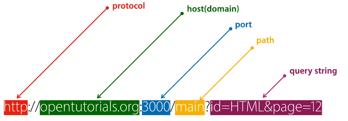

# WEB2 - Node.js

## 수업소개

- javascript로 Server Side Application을 만들 수 있는 Node.js
- 2008년 구글은 크롬 웹브라우저에서 동작하는 V8엔진을 오픈소스로 공개한다.
    - Node.js는 JS를 이용하여 V8엔진을 바탕으로 OS위에서 동작한다.


------------------------------------------

## 수업의 목적

- 생산성의 한계를 타파한다.
    - Node.js를 사용하면 하나의 파일로 수많은 웹 페이지의 내용을 수정할 수 있다.
    - 사용자가 페이지를 요청할 때 마다 Node.js가 그에 맞는 HTML 코드를 생성.

- 사용자의 참여가 가능하다.

------------------------------------------

## Node.js - 설치

- Node.js runtime을 설치하여 js를 통하여 Node.js Application을 만든다.
- cli 환경에서 접속하여 node를 실행시킬 수 있다.
    - ```node -v``` : 현재 버전을 확인
    - ```node 파일이름.js``` : 해당 파일을 node로 실행
    - ```node``` : 인터프리터 실행

#### Codeanywhere
- [Codeanywhere](https://codeanywhere.com/)
- 무료로 개발서버를 대여
- 로그인 > Editor > Connection Wizard에서 Node.js Ubuntu 선택
- Info에서 해당 서버의 URL 주소를 알 수 있다.
- 터미널을 켜서 위와 같은 명령어를 실행가능.

------------------------------------------

## Node.js - 웹서버 만들기

- Node.js 도 Apache처럼 웹서버로 사용될 수 있다

```
var http = require('http');
var fs = require('fs');
var app = http.createServer(function(request,response){
    var url = request.url;
    if(request.url == '/'){
        url = '/index.html';
    }
    if(request.url == '/favicon.ico'){
        response.writeHead(404);
        response.end();
        return;
    }
    response.writeHead(200);
    response.end(fs.readFileSync(__dirname + url));
});
app.listen(3000);
```

- ```__dirname + url``` 경로에 해당되는 파일을 ```fs.readFileSync()```코드로 읽어서 ```response.end``` 를 통해 사용자에게 보낸다.
- 프로그래밍 적으로 사용자에게 보낼 데이터를 생성한다.

------------------------------------------

## JavaScript - Template Literal

- 하나의 문자열을 코드상에서 여러줄로 표현하고 싶을 때 ```\```을 넣으면 된다.
```
'Hello\
World'
```

#### Template Literal
- 여러줄로 이루어진 문자열의 표현과 문자의 치환을 쉽게 할 수 있는 기능
    - 문자열 표현시 따옴표 대신 ``` ` ```을 사용하며 입력된 문자(개행 포함) 그대로 표현할 수 있다.
    - ```${변수명}``` 을 사용하여 문자열 안에서 변수를 사용할 수 있다.
```
`Dear ${name}

Lorem ipsum dolor sit amet, conse`
```

------------------------------------------

## Node.js - URL로 입력된 값 사용하기

- 같은 파일이지만 URL에 입력된 값(**쿼리 스트링**)을 사용하여 다른 응답을 할 수 있다.
    - 쿼리 스트링을 사용하면 웹 서버에게 정보(데이터)를 전달할 수 있다.
    - 쿼리 스트링의 시작은 ```?``` 이다.
    - 값과 값 사이는 ```&```을 사용한다.
    - 값의 이름과 값은 ```=```로 구분한다.



- url의 값은 ```request.url```에 들어가게 된다.
    - port이후 path부터 나온다.(ex. ```/?id=HTML```)

### url 모듈
```
var url = require('url');

var app = http.createServer(function(request,response){
    var _url = request.url;
    var queryData = url.parse(_url, true).query;
    console.log(queryData.id);
});
```
- ```url.parse(_url, true).query```는 객체로 반환되며 쿼리 스트링으로 들어온 값을 담고 있다.

------------------------------------------

## App - 동적인 웹페이지 만들기

- 쿼리 스트링과 Template Literal을 사용하여 동적인 웹 페이지를 생성한다.
  
```JS
var http = require('http');
var fs = require('fs');
var url = require('url');

var app = http.createServer(function(request,response){
    var _url = request.url;
    var queryData = url.parse(_url, true).query;
    var title = queryData.id;

    if(_url == '/')
      title = 'Welcome';
    
    if(_url == '/favicon.ico')
      return response.writeHead(404);
    
    response.writeHead(200);

    var template = `
    <!doctype html>
    <html>
    <head>
      <title>WEB1 - ${title}</title>
      <meta charset="utf-8">
    </head>
    <body>
      <h1><a href="/">WEB</a></h1>
      <ul>
        <li><a href="/?id=HTML">HTML</a></li>
        <li><a href="/?id=CSS">CSS</a></li>
        <li><a href="/?id=JavaScript">JavaScript</a></li>
      </ul>
      <h2>${title}</h2>
      ...
    </body>
    </html>
    `;
    response.end(template);
 
});
app.listen(3000);
```


------------------------------------------

## Node.js - 파일 읽기

### CRUD
- 정보를 다루는 핵심적인 기능들
1. Create
2. Read
3. Update
4. Delete

#### 파일을 Node.js를 통해서 CRUD 한다.

### 파일 읽기
```
var fs = require('fs');
fs.readFile('sample.txt', 'utf8', function(err, data){
    console.log(data);
});
```
- ```fs``` : file system 모듈
- ```fs.readFile``` : 파일을 읽는 함수
    - 파일의 이름(경로), 인코딩 방식, 읽은 이후의 콜백함수를 인자로 준다.
        - **파일의 경로는 node가 실행된 디렉토리를 바탕으로 한다.**
    - 콜백함수의 두번째 인자에는 읽은 파일의 내용이 들어있다.


------------------------------------------

## App - 파일을 이용해 본문 구현

```JS
 fs.readFile(`data/${queryData.id}`, 'utf8', function(err, description){
      var template = `
      <!doctype html>
      <html>
      <head>
        <title>WEB1 - ${title}</title>
        <meta charset="utf-8">
      </head>
      <body>
        <h1><a href="/">WEB</a></h1>
        <ul>
          <li><a href="/?id=HTML">HTML</a></li>
          <li><a href="/?id=CSS">CSS</a></li>
          <li><a href="/?id=JavaScript">JavaScript</a></li>
        </ul>
        <h2>${title}</h2>
        <p>${description}</p>
      </body>
      </html>
      `;
      response.end(template);
    })
```

------------------------------------------

## JavaScript - 비교 연산자

- ```==``` 좌항과 우항의 값이 같으면 true, 다르면 false
    - ```===```을 통해서 더욱 정확히 비교할 수 있다.
    - 큰 이유가 없다면 ```===```을 사용하자.
------------------------------------------

## JavaScript - 제어문

- 프로그램은 시간의 순서에 따라 실행되는 것을 말한다.
- 상황에 따라 다르게 동작하게 하는 것이 제어문
    - 조건문 : 상황에 따라 다르게
    - 반복문 : 상황에 따라 반복되게

------------------------------------------

## Node.js - 콘솔에서의 입력값

- 프로그램은 입력(INPUT)에 대해서 정보를 처리하고 출력(OUTPUT)을 해주는 것이다.
- INPUT
    - Parameter : 입력되는 정보의 형식
    - Argument : 형식에 맞춰서 입력된 값

- 터미널에서 ```node 파일명 입력값```형식으로 실행. (ex. ```node app.js egoing```)
    - ```pocess.argv```을 통해 입력된 값을 얻을 수 있다.
    - 0번째 인덱스 : node.js의 runtime 프로그램의 위치
    - 1번째 인덱스 : 실행시킨 파일의 경로
    - 2번째 인덱스 부터 전달된 입력값이 있다.

```JS
node app.js egoing      //터미널에서
-----------------------

var args = process.argv;
console.log(args[2]);       //egoing
```

------------------------------------------

## App - Not found 오류 구현

#### 존재하지 않는 정보에 대한 요청이 들어왔을 때 Not found 오류 메시지를 전송

-  ```url.parse(_url, true).pathname``` : 쿼리 스트링을 제외한 path의 값.
    - 다른 path로 온 경우 404코드와 Not found 메시지를 전송
        - ```response.writeHead(404);```
        - ```response.end('Not found');```

```JS
var _url = request.url;
var queryData = url.parse(_url, true).query;
var pathname = url.parse(_url, true).pathname;
var title = queryData.id;

if(pathname === '/'){
    fs.readFile(`data/${queryData.id}`, 'utf8', function(err, description){
        var template = `...`;
        response.writeHead(200);
        response.end(template);
    });
} else {
    response.writeHead(404);
    response.end('Not found');
}
```

------------------------------------------

## App - 홈페이지 구현


------------------------------------------

## JavaScript - 반복문


------------------------------------------

## JavaScript - 배열


------------------------------------------

## JavaScript - 배열과 반복문


------------------------------------------

## Node.js - 파일 목록 알아내기


------------------------------------------

## App - 글목록 출력하기


------------------------------------------

## JavaScript - 함수의 기본 문법


------------------------------------------

## JavaScript - 함수의 입력


------------------------------------------

## JavaScript - 함수의 출력


------------------------------------------

## App - 함수를 이용해서 정리 정돈하기


------------------------------------------

## 수업의 정상


------------------------------------------

## Node.js - 동기와 비동기 그리고 콜백


------------------------------------------

## Node.js - 패키지 매니저와 PM2


------------------------------------------

## HTML - Form


------------------------------------------

## App - 글생성 UI 만들기


------------------------------------------

## App - POST 방식으로 전송된 데이터 받기


------------------------------------------

## App - 파일생성과 리다이렉션


------------------------------------------

## App - 글수정 - 수정 링크 생성


------------------------------------------

## App - 글수정 - 수정할 정보 전송


------------------------------------------

## App - 글수정 - 수정된 내용 저장


------------------------------------------

## App - 글삭제 - 삭제버튼 구현


------------------------------------------

## App - 글삭제 기능 완성


------------------------------------------

## JavaScript - 객체의 형식


------------------------------------------

## JavaScript - 객체의 반복


------------------------------------------

## JavaScript - 객체 - 값으로서 함수


------------------------------------------

## JavaScript - 객체 - 데이터와 값을 담는 그릇으로서 객체


------------------------------------------

## App -객체를 이용해서 템플릿 기능 정리 정돈하기


------------------------------------------

## Node.js - 모듈의 형식


------------------------------------------

## App 제작 - 모듈의 활용


------------------------------------------

## App - 입력 정보에 대한 보안


------------------------------------------

## App - 출력정보에 대한 보안


------------------------------------------

## API


------------------------------------------

## 수업을 마치며


------------------------------------------

## 보충수업 - PM2 사용법


