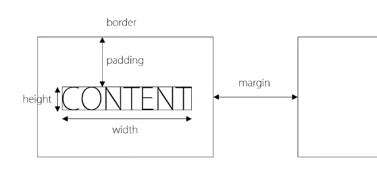
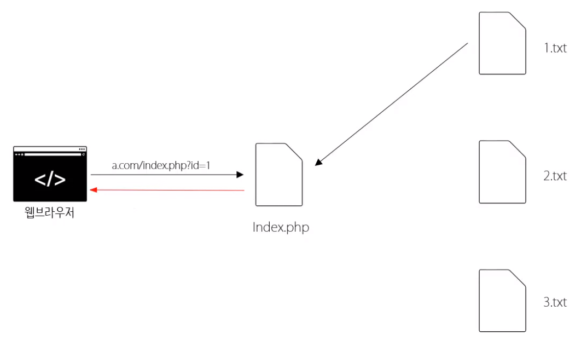
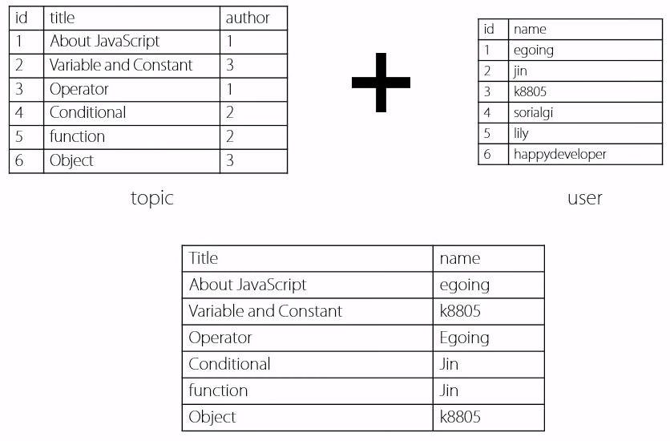

# 웹 어플리케이션 만들기 수업자료

## 수업소개
### 우리가 하려는 것
1. 게시판 제작
2. 글 쓰기 지우기 기능
3. 반응형 웹

-----------------

## 웹 어플리케이션을 만드는 순서
1. 구상
2. 기획 (계획)
3. 디자인 (UX UI)
4. 개발
5. 테스트 (QA)

### Start Small
### 복잡도

-----------------

## 구상 & 계획

1. 무엇을 만들것인가?
    1. 어떤 것을 보여줄 것인지
    2. 어떤 방식으로 보여줄 것인지
2. 어떻게 동작해야 하는가?
    - UI 모델링
        1. UI : 사용자가 시스템을 제어하는 조작장치
        2. 모델링 : 가상으로 만들어 보는 것. **소통의 도구!**
        - [oven](https://ovenapp.io/)

-------

## 인터넷과 웹의 역사

### 인터넷 =/= 웹


- 인터넷 : 전 세계에서 가장 거대한 네트워크
- 웹 : 인터넷을 활용하여 HTML을 주고 받을 수 있도록 한 서비스


**웹은 가장 성공한 인터넷의 서비스이다.**

### 팀 버너스리


----------------


## 서버와 클라이언트


- 인터넷 상의 서비스들은 서버와 클라이언트라는 체계 위에서 동작한다.
- 모든 컴퓨터는 서버 혹은 클라이언트가 될 수 있다.
    - 서버와 클라이언트는 상대적인 개념이다.

### 준비물
- 웹 브라우저 : 크롬
- 웹 서버 : Bitnami (Apache)
    - 앞으론 뭔가를 설치할 때 각오하자.

--------

## 웹서버 설치

### bitnami 설치


-----------

## 서버 제어

### wampstack manager stack
- Apache나 MySQL을 켜고 끌 수 있다.
- 윈도우는 항상 켜져있다.
- Configure에서 여러 정보 확인/수정 가능 


--------

## 프로그래밍 언어

사람과 컴퓨터 사이의 약속

코드, 소스 : 사람이 작성하는 소프트웨어(프로그램)의 설계도

---------

## HTML 이론

### Hypertext Markup Lanuage
- Hypertext : 문서와 문서가 **링크**로 연결되어 있다.
- 링크로 인해 문서와 문서가 그물망 처럼 연결되어 거대한 정보 덩어리를 만든것이 웹
- Markup : TAG.


### HTML 문법 - 속성
#### 하이퍼링크 : a태그


- a태그만으론 이를 표현할 수 없다.
    - 이때 사용하는 것이 바로 속성

``` 
<a href="http://opentutorials.org/course/1">생활코딩</a> 
<a href="http://opentutorials.org/course/1" target="_blank">생활코딩</a>
<a href="http://opentutorials.org/course/1" target="self">생활코딩</a>
```


### HTML 문법 - 태그의 중첩

#### LIST : ul태그, ol태그, li태그

- li : 리스트 아이템
- ul : unordered list - 순서가 없는 리스트
- ol : ordered list - 순서가 있 리스트

#### 태그의 중첩
- html : 태그 안쪽의 내용이 html이다.
- head : 문서를 설명하는 내용
- body : 문서의 내용 (본문)

```
<html>
    <head>
        <meta charset="utf-8" />
        <title>생활코딩</title>
    </head>
    <body>
        .....
    </body>
</html>
```

### HTML 정리
- 팀 버너스리에 의해 만들어지고 W3C에 의해 표준이 정의됨

``` <!DOCTYPE html> ```
- 해당 html 문서가 어떤 표준인지 말해준다.

#### TAG Reference
- [W3C](http://dev.w3.org/html5/html-author/)
- [Opentutorials Html Reference](http://opentutorials.org/course/1058)

#### HTML의 본질
- 어떠한 정보를 사람도, 컴퓨터도 이해할 수 있게 태그를 이용해서 규정하고 정의!
    - 꾸미는 역할은 CSS에게, 나머지는 JS에게 맡김.
    - HTML은 정보를 정의!

#### 웹 접근성
- 시각장애인들은 어떻게 웹을 탐색하고 정보를 파악할까?
    -  전맹 시각장애인은 화면 읽기 프로그램(이하 스크린 리더)와 키보드를 사용하여 정보를 탐색
    - 저시력 시각장애인은 화면 확대 프로그램과 고대비, 반전 등의 기능을 사용합니다.
- 스크린 리더 사용자는 정보를 인식하고 운용하기 위해 이미지의 대체 텍스트, 모든 콘텐츠의 키보드 접근, 초점의 논리적인 이동 등이 절대적으로 보장되어야 합니다.
- 효율적인 탐색을 위해서 문서의 구조화(HTML 5의 시맨틱 테그 사용과 헤딩, 랜드마크 등)이 매우 중요합니다.
- 입력서식의 레이블과 테이블 scope 등도 정보 파악에 큰 도움이 됩니다. 
- **결론적으로 표준을 잘 지키고 기본에 충실한 것이 가장 좋다**

---------------------

## HTML 실습

### 모델링을 HTML로 만들기
- 제목 태그 (H태그)
    - H1 ~ H6 까지 제목을 표시할 수 있다.

    ``` <h1>제목</h1> ```

- 목록은 List 태그를 사용.
- 이러한 과정을 마크업 과정이라고 한다.

### 의미론적인 웹
- Semantic Web : 의미가 잘 드러나는 웹
- 웹에서 HTML이 차지하는 역할은 정보! 이 역할에 충실하기 위해 HTML은 발전해 왔다.
    - 디자인 담당하는 태그나 역할은 전부 CSS로 갔다.
    - HTML 문서에서 정보로써의 가치를 높여주는 시멘틱 태그들이 나타났다.
- 사람 뿐아니라 기계들도 HTML의 의미를 이해할 수 있도록 하는 태그들
    - 특별한 기능이 있는 것은 아니다.
    - ```<header>``` : 헤더. 해당 문서의 간판.
    - ```<nav>``` : 네비게이션. 내부의 내용은 웹 사이트를 탐색할때 사용된다는 뜻.
    - ```<article>``` : 아티클. 문서의 본문
    - ```<footer>``` : 푸터. 문서의 끝부분. 부가정보

### 사이트 완성
- index.html(확장자는 중요하지 않다.)
    - 웹 서버의 대문과도 같은 페이지.
    - 일반 주소를 치면 해당 페이지가 나오게 된다.
    - nav 영역의 항목들은 링크로 해줘야 한다.

-------------

## 개발도구

### 도구의 필요성
- 파워풀한 도구일 수록 잘 다루기 힘들다. 학습비용이 들게된다.
- 버전 관리 시스템 (Version Control System)
    - 변경된 코드에 대한 기록을 해준다.
    - 언제 어디서 문제가 발생했는지 쉽게 알 수 있다.
    - 다른 서버 컴퓨터에 백업하여 만약의 사고에 대비할 수 있다.
    - 협업시 똑같은 파일을 수정할 때 지침이 되어준다.
    - SVN, git 
- 코드 편집기 (Editor)
    - [Atom](https://atom.io/)
    - 좋은 도구를 사용하도록 노력해야 한다.

### Atom
- Opne Folder에서 Root Directory를 설정한다.
- 에디터의 확장기능(패키지, 플러그인)
    - file > Settings 에서 설치가능
    - emmet

-------

## CSS 이론

### CSS 기본문법
- Cascading Style Sheet
- Style : 정보(HTML)를 예쁘게 꾸며주는 역할
- sytle태그 : 내부 내용을 CSS로 해석해야 함을 알려주는 태그
#### 선택자


### 선택자 심화학습
- 태그에게 효과를 주는 하나 하나를 **속성**이라고 한다.
- 속성과 속성을 구분해주는 구분자는 세미콜론(;)
- 선택자를 사용하여 세부적인 내용을 수정할 수 있다.

```
<style>
    h1,h2 {
        color:red;
        font-size:10px;
    }
    h2 {
        text-decoration: underline;
    }
    header h1{
        border : 1px solid blue;
    }
</style>
```

### 박스 모델
- 태그들의 위치, 부피, 여백을 지정
- HTML의 id 속성 : 특정 태그만을 선택하려고 할때 사용
    - ``` <tag id="id_name">contents</tag> ```
    - CSS에서 ```#id_name { ... }``` 으로 사용 가능

- border 속성 : 테두리.
    - 두께, 색상, 선의 종류를 띄어쓰기를 사용하여 구분후 작성
    - ``` border: red 1px solid; ```

- padding : 테두리와 컨텐츠 사이의 거리
- margin : 태그와 태그 사이의 간격


- 구글 개발자 도구로 박스모델 알아보기

### float 

- img1 태그 : 이미지를 표현
    - ``` <img1 src="img1_url" /> ```
- float 속성 : 두 개의 컨텐츠가 나란히 화면에 배치되게 한다.
    - right 혹은 left 를 값으로 준다.
    - ``` float:right; ```


-----

## CSS 실습

- CSS 외부 분리 후 링크 : 여러 페이지에 하나의 동일한 CSS를 적용시키고 싶을 때. **중복의 제거**
    - 확장자가 css인 파일을 만들고 거기에 css 코드를 입력
    - 아래의 코드를 head 태그 내부에 입력
    - ``` <link rel="stylesheet" type="text/css" href="css_url"> ```


- style.css
```
header{
    border-bottom:1px solid gray;
    padding:20px;
}
nav {
    border-right:1px solid gray;
    width:200px;
    height:600px;
    float:left;
}
nav ol{
    list-style:none;
}
article{
    float:left;
    padding:20px;
}
h2{
    font-size:50px;
}
```

- stylebot

------

## 프로그래밍 (JS, PHP 이론)

1. HTML
    - 웹의 태동과 같이 나옴.
    - 정보를 전달
2. CSS
    - 디자인을 담당
3. JavaScript
    - 사용자의 동작에 따른 웹 페이지와 사용자간의 상호작용
4. PHP
    - 웹 페이지를 보여주거나 생산하는데 생산성을 높여준 언어
5. MySQL
    - 수 많은 데이터를 관리할 수 있는 데이터베이스

#### 이러한 것들이 모여 거대한 웹을 이룬다.

-------

## 프로그래밍 - 복습과 수업 예고

#### 클라이언트에서 동작하는 언어들
- Front-end
- Client-side


#### 서버에서 동작하는 언어들
- Back-end
- Server-side


------------

## 프로그래밍 - JavaScript vs PHP

- JavaScript는 웹 브라우저에서 PHP는 서버에서 작동한다.
    - 이 둘은 경쟁적이며 협력적인 관계

- HTML, CSS는 정적인 언어
    - 문서의 정보와 스타일을 위한 정적인 언어.
- JavaScript와 PHP는 동적인 언어이다.
    - 상황에 따라 다르게 동작하는 동적인 언어.
    - HTML에서 CSS를 분리시킨것 처럼, HTML에서 정보만 따로 분리하여 불러오는 것이 PHP의 능력이다.


-----------

## 프로그래밍 - 웹페이지에 코드 삽입하기

### PHP
```
<?php
    echo "Hello, World!";       //화면에 표시
?>
```
- PHP 문서에서 ```<?php ?>``` 사용
- 내부의 코드는 php의 문법으로 해석된다.
- 이는 서버에서 해석되며, 브라우저에는 결과만 나타난다.
    - 웹 서버는 php 문서를 요청 받으면 해당 php문서를 php 인터프리터에게 넘기며 php 인터프리터는 웹 서버에게 코드를 해석한 결과를 전달한다.

### JavaScript
```
<script>
    document.write("Hello, World!");    //문서에 write (화면에 표시)
</script>
```
- HTML, PHP 문서에서 ```<script>``` 태그 사용
- 내부의 코드는 JavaScript의 문법으로 해석된다.
- 이는 브라우저에서 해석되며 브라우저에서 코드도 확인할 수 있다.

--------

## 프로그래밍 - 데이터타입과 연산자

|   | javascript | PHP |
|:--:|:--:|:--:|
| 문자  | "100000"  | "100000"  | 
| 숫자  |  100000   | 100000  | 
|  문자+문자 연산자 | "10"+"10"   |  "10"."10" |  
|  숫자+숫자 연산자 | 10+10  |  "10"+"10" / 10+10 |  

------------

## 프로그래밍 - 디버깅

- 디버그 : 오동작된 현상을 해결하는 행위
- 어디에서 오류가 생겼는지 찾을 수 있어야 한다.

#### JavaScript
- 크롬 개발자 도구의 **자바스크립트 콘솔**에서 어디서 오류가 나타났는지 알 수 있다.
#### PHP
- wampstack 폴더 > apache2 폴더 > logs 폴더 > error.log 파일 최하단에서 확인
- 혹은 php.ini 파일에서 display_errors의 값을 On으로 바꾼다.


-------------

## 프로그래밍 - 변수

|   | javascript | PHP |
|:--:|:--:|:--:|
| 변수  | ```name="egoing"; ``` | ```$name="egoing"; ``` | 

- 변할 수 있는 부분에 집중하여 이러한 곳에는 변수를 사용한다.

----------

## 프로그래밍 - 비교

- Boolean : True 혹은 False의 값을 갖는 자료형
- php는 boolean을 바로 표현하기 힘들기 때문에 echo 대신 var_dump()를 사용

```
<script charset="utf-8">
    document.write(2==1);
</script>

<?php
    var_dump(2==1);
?>
```

----------------

## 프로그래밍 - 조건문

```
if(true/false){
    true인 경우 실행
}else{
    false인 경우 실행
}
```


----------------

## 프로그래밍 - 로그인 기능 만들기

### 사용자가 입력한 값을 받아내는 방법!

### 자바스크립트로 로그인 기능 구현하기
```
<script>
    password = prompt("비밀번호");

    if(password == 1111) {
        document.write("안녕하세요. 주인님");
    } else {
        document.write("뉘신지?");
    }
</script>
```
- prompt로 받은 값을 password 변수에 대입
- 사용자의 입력값에 따라 동작이 달라진다.
    - HTML은 할 수 없는 일

### PHP로 로그인 기능 구현하기

- PHP 파일간 데이터를 전달할 수 있다.
    - GET : URL이 변경되는 방식
    - POST : URL이 변경되지 않는 방식 (보안)

#### 8-1.php
```
<form action="8-2.php">
    <p>비밀번호를 입력해주세요.</p>
    <input type="text" name="password">
    <input type="submit">
</form>
```
1. form 태그와 input태그를 통해 데이터를 입력받음
2.  ```<input type="submit">```을 통해 데이터를 ```action="8-2.php"```으로 전송
3. 데이터를 8-2.php에 전달하며 8-2.php 어플리케이션이 실행.
4. 데이터는 URL에서 '?' 뒤에 name=value 형식으로 들어간다.
    - ex. http://localhost/8-2.php?password=1111

#### 8-2.php
```
<?php
    $password = $_GET["password"];
    
    if($password == "1111"){
        echo "주인님 환영합니다";
    } else {
        echo "뉘신지?";
    }
?>
```
-  ```$_GET["name"];``` : 사용자가 입력한 정보 중 name이 "name"인 것의 값


------------

## 프로그래밍 - 반복문

```
while(true/false){
    ...
}
```

---------------

## 프로그래밍 - 배열

### Javascript
```
list = new Array("one", "two", "three");
list[0];

//배열의 길이
list.length;
```

### PHP
```
$list = array("one", "two", "three");
$list[0];

// 배열의 길이
count($list);
```

### 배열과 반복문
- 반복문의 조건에 배열의 길이를 사용
```
while(i < list.length){
    list[i];
}

while($i < count($list)){
    $list[$i];
}
```


--------------

## 프로그래밍 - 함수

### 함수의 기본 문법

- 입력에 따른 출력이 있는 것.
- 연관되어 있는 코드를 모아 함수를 만들고 이를 부품으로 사용한다.
    - 이러한 함수를 모아서 하나의 프로그램이 만들어진다.
    - 복잡도를 낮춰준다.

```
function function_name(){
    ....
}
function_name();
```

### 함수의 입력과 출력
```
function a(input){
    return input+1;
}

document.write(a(6));
```
- 입력 값을 함수에서 처리하고 return 으로 반환(출력)한다.

------------

## 프로그래밍 - UI vs API

### UI
- User Interface

### API
- Application Programming Interface
- 어떤 프로그램이 어떤 프로그래밍 언어를 사용하여 무언가를 제어.

### Interface
- 장치와 장치, 사람과 장치, 프로그램과 프로그램 사이의 접점


- prompt는 일종의 인터페이스
    - 우리가 만든 어플리케이션이 웹 브라우저에게 무언가를 요청(제어)한다.

- UI > Application > Web Browser > OS

-------------

## 프로그래밍 - 프로그래밍 접근방법

- 적정 용도의 언어를 적정 수준으로 배워라.
    1. 장기적으론 프로그래밍의 실력을 키워나가야한다.
    2. 단기적으론 서툰 실력으로 많은것을 만들어봐야 한다. 

- API를 탐험해 보자.
    - 프로그래밍 언어로 API를 조합하여 어플리케이션을 만들어보자.

- 어플리케이션을 좋아할 관객을 찾아보자.
    - 자기자신부터 시작.

- 선배들의 힘을 빌리자

- 처음부터 힘든 것을 배우지 말자.
    - 공감하기 힘들고, 의지가 약해진다.
    - Start Small

------------------------------------

## 자바스크립트 실습
- 화면의 색을 바꿔주는 버튼!
- JavaScript는 HTML을 프로그래밍적으로 제어한다.
- 단일 태그인 경우 끝에 닫는태그 대신 여는태그 마지막에 /를 추가해도 된다.
- ```<intput type="입력할 방식" value="값" />```
- 사용자가 웹 어플리케이션에 정보를 입력 할 수 있는 장치
- type에 따라서 정보를 입력하는 방식이 달라진다.
- ```alert('문자열')```
- 설정한 문자열을 띄우며 경고창을 띄우는 js 함수.

#### JavaSciprt 이벤트
```
<input type="button" value="white" onclick="alert('Hello, World!')" />
```
- js의 코드는 script 내부 뿐 아니라 html 태그 안에서도 작성 가능하다.
- html파서는 onclick을 보면 해당 element를 클릭했을 때 값으로 설정된 자바스크립트 코드를 실행하도록 설정해 놓는다.
- 이러한 것을 이벤트 프로그래밍이라고 한다.
- 여러가지 사건(이벤트)을 통해서 어떠한 코드가 실행되어야 한다는 것을 브라우저에게 명령해 놓는다.
- 이러한 이벤트 속성들은 여러가지가 있으며, 이 속성들의 값은 자바스크립트의 코드이다.

```
<input type="text" id="user_input" />
<input type="button" value="white" onclick="alert(document.getElementById('user_input').value)" />
```
- ```document.getElementById('태그의 id 속성의 값')```
- id 속성의 값을 통해서 원하는 HTML 요소를 가져올 때 사용.

- class 속성
- 태그들을 그룹핑 할 수 있다.
- 선택자는 ```. ``` 이다. (ex. ```.em { ... }```)

#### JavaScript는 HTML을 제어하는 언어
```
<input type="button" value="강조" onclick="document.getElementById('target').className='em'" />
```
- ```document.getElementById('target')``` 를 사용하여 해당 요소를 얻고, ```.className='em'```을 통해서 class 값을 지정.

```
<input type="button" value="white" onclick="document.getElementById('target').className='white'">
<input type="button" value="black" onclick="document.getElementById('target').className='black'">
```

#### JavaScript는 HTML을 제어할 수 있다.

- div 태그 : 특정 태그들을 묶을 때 사용
- js를 밖으로 빼내기
- ```<script src="js파일의 주소"></script>```


----------------------------


## PHP 실습


- 정보들을 이제는 HTML이 아닌 FILE에 저장한다.
    1. 웹 브라우저가 웹서버에게 요청하면
    2. 웹 서버는 PHP에게 요청한다.
    3. PHP는 우리가 작성한 코드에서 **파일을 읽어오는 기능**을 수행한다.
    4. 파일의 정보를 결합하고 이를 웹서버에게 건낸다.
    5. 웹서버는 해당 파일을 웹 브라우저에게 응답한다.

- 이전에는 각 정보(주소)마다 HTML을 하나씩 가지고 있었다.
    - 특정부분을 수정하게 되면 모든 HTML파일을 수정해야 했다.
    - 즉, 중복이 존재했다.

- 이제는 PHP파일을 하나만 사용한다. 그리고 정보들은 따로 빼둔다.
#### PHP파일은 사용자가 입력한 파라미터를 통해서 필요한 정보를 가져온 후 결과를 만들고 이를 보여준다.



- 하지만 파일에 데이터를 저장하는 것은 좋은 방법이 아니다
- 우리는 최종적으로 데이터베이스를 쓸 것이다.


### PHP로 파라미터 받아오기
- url : http://.../1.php?name=egoing&id=1&age=20
- 주소와 값의 구분 : ```?```
- 값과 값의 구분 : ```&```
```
<?php
echo $_GET['id'];
?>
```

### PHP로 파일 읽어오기
- file_get_contents 함수 사용
```
file_get_contents("읽으려는 파일의 path")
file_get_contents("1.txt")
file_get_contents($_GET['id'].'txt')
```

- echo 이후 태그가 와도 웹 브라우저는 HTML 코드로 인식하기 때문에 상관없다.
- 값이 있는지 확인하는 함수 : empty

```
<?php
    if( empty($_GET['id']) == false ) {
        echo file_get_contents('./txt/'.$_GET['id'].'.txt');
    }
?>
```

- 이제는 HTML과 정보를 분리시킨 것이다.
- 이렇게 분리를 통해 중복을 제거하면, 하나의 파일을 수정하면 모든 페이지에 수정된 것이 적용된다.


----------------------------

## 데이터베이스(MySQL) 이론

- 데이터베이스 : 정보를 관리하는 전문적인 에플리케이션
- HTML에서도 가장 중요한 것은 정보
- 정보가 위치하는 곳이 정말 중요한데, 근대의 웹 어플리케이션은 데이터베이스에 정보가 저장된다.
- 정보를 안전하게 보관할 수 있다.

| FILE | DATABASE|
| :-: | :-: |
| 가장 기본적이고 원시적인 형태의 데이터 관리수단 |정보를 관리하는 전문적인 수단 |
| 어느 시스템에서나 쓸수 있고 이해하기 쉽다. | 어플리케이션을 설치하고 공부도 해야한다. |

- 하지만 DATABASE를 쓴다.
- 안전하다 : 누군가가 정보를 무단으로 보지 못한다. 시스템이 고장났을 때 백업하는 시스템을 갖췄다.
- 빠르다 : 인덱스(색인)를 통해 정보를 빠르게 찾을 수 있도록 정리되어 있다.
- 프로그래밍적 제어가 가능하다.


#### MySQL
- 관계형 데이터 베이스
- WEB과 밀접한 관계, opne source를 통해 개발되었다.
- MariaDB와 호환성이 좋다.
- 구조화 (Structured)
- 표(table)

#### SQL
- Structured Query Language
- 컴퓨터에게 구조화된 정보를 질의하는 프로그래밍 언어


- SQL문을 통해 질의하고 이에 해당하는 정보(표)를 클라이언트에게 전송한다.


#### 데이터베이스 역시 Server와 Client가 존재한다.

#### MySQL monitor
- MySQL의 표준적인 클라이언트
- 데이터베이스 서버가 동작하는 모습을 투명하게 보여준다.


1. 윈도우 : cmd를 통해 MySQL monitor 사용
2. 맥 & 리눅스 : 터미널을 통해 MySQL monitor 사용


- Bitnami의 폴더 안의 mysql > bin 폴더 안에 mysql이라는 응용프로그램을 실행시킨다.
```
mysql -hlocalhost -uroot -p
```
- mysql 프로그램을 실행
- -hlocalhost : 호스트(서버)의 주소는 localhost
- -uroot : 유저는 root
- -p : 비밀번호 입력방식


- DATABASE : 테이블을 묶어주는 일종의 디렉토리
- Table : 정보를 모아놓는 일종의 파일

- 데이터베이스 보기
    - ```show databases;```
- 데이터베이스 생성
    - ```CREATE DATABASE opentutorials CHARACTER SET utf8 COLLATE utf8_general_ci;```
- 데이터베이스 선택
    - ```use opentutorials;```
- 테이블 생성
    - 각 데이터의 칼럼마다 자료형을 강제함으로써 믿고 정보를 쓸 수 있도록 한다.
    - AUTO_INCREMENT : 값을 따로 입력하지 않아도 행이 입력할 때 마다 값이 1씩 증가되며 자동으로 추가된다.
```
CREATE TABLE `topic` (
`id` int(11) NOT NULL AUTO_INCREMENT,
`title` varchar(100) NOT NULL,
`description` text NOT NULL,
`author` varchar(30) NOT NULL,
`created` datetime NOT NULL,
PRIMARY KEY (id)
) ENGINE=InnoDB DEFAULT CHARSET=utf8;
```
- 테이블 보기
    - ```show tables;```
- 데이터 삽입 (행 추가)
    - ```INSERT INTO 테이블명 (컬럼들) VALUES (값들)```
- 문자를 입력할 땐 ``` ' ``` 컬럼이나 테이블의 이름을 쓸때는 ``` ` ```를 사용한다.
- 데이터 찾기
    - ```SELECT 컬럼들 FROM 테이블명```
    - ```SELECT 컬럼들 FROM 테이블명 WHERE 조건```
        > 조건에 맞는 데이터만 준다.
    - ```SELECT 컬럼들 FROM 테이블명 ORDER BY 칼럼 DESC```
        > 정해둔 칼럼에서 오름차순으로 정렬후 데이터를 준다.
- 끝에 \G를 붙여주면 긴 내용도 깔끔하게 출력된다.

----------------------------

## MySQL 실습

- PHP가 중계자 역할을 한다고하여 미들웨어라고 부르기도 한다.
- PHP의 API인 mysqli를 사용한다.
- error.log를 통해서 어디서 에러가 났는지 확인할 수 있다.

| | Mysql monitor | mysqli
|:-:|:-:|:-:|
|서버 접속 | ```mysql -hlocalhost -uroot -p111111``` | ```$conn=mysqli_connect('localhost','root','111111');```|
|DB선택 | ```use op;``` | ```mysqli_select_db($conn, op')``` |
|조회 | ```SELECT * FROM topic``` | ```$result = mysqli_query($conn, 'SELECT * FROM topic')``` |
|출력 | | ```$row = mysqli_fetch_assoc($result);``` |


### 연관배열 (Associative Array)
```
$a = array("title"=>"JS", "desc"=>"JS is ...");

$row = mysqli_fetch_assoc($result);
```
- 각 값에 이름을 줘서 배열을 생성하는 것.
- ```mysqli_fetch_assoc```함수 는 조회한 테이블의 첫번째 값만 받아서 연관배열로 반환한다.
- 이를 두번 실행하면 결과의 두번째 행을 출력한다.

### PHP에서 MySQL 사용하기
```
<?php
$conn = mysqli_connect('localhost', 'root', '111111');
mysqli_select_db($conn, 'op');
$result = mysqli_query($conn, "SELECT * FROM topic");

while($row = mysqli_fetch_assoc($result)){
    echo '<li><a href="http://localhost/index.php?id='.$row['id'].'">'.$row['title'].'</a></li>\n'
}

if(empty($_GET['id']) === false ) {
    $sql = 'SELECT * FROM topic WHERE id='.$_GET['id'];
    $result = mysqli_query($conn, $sql);
    $row = mysqli_fetch_assoc($result);
    echo '<h2>'.$row['title'].'</h2>';
    echo $row['description'];
}
?>
```
- 가져올 데이터에 맞는 sql문을 짜고 이를 통해서 얻어온 값을 php를 사용하여 나타낸다.

### 글 작성페이지 생성
- form : 사용자가 입력한 정보를 서버로 전송되도록 하는 태그
    - 어디로 보내야 할지(action 속성) 어떤 방식으로 보내야 할지(method 속성) 정한다.
    - 짧은 글은 input태그의 type=text, 긴글은 textarea 태그를 사용한다. (속성이 아니다.)

- 서버로 전송하는 url은 길이의 제한이 있기 때문에 긴 정보는 url 입력방식(GET)으론 전송할 수 없다.
    - POST 방식을 사용한다!
    - POST 방식을 사용하면 데이터를 받을 때 ```$_POST['값의 이름']```을 사용한다.

- MySQL의 now()함수를 사용하여 현재시간 기록 가능
- Redirection : 다른 페이지로 이동시켜 준다.
    - ```header('Location: http://localhost/index.php');```


----------------------------

## 관계형 데이터베이스 이론
- Relational
    - 서로 다른 테이블들이 관계를 맺으며 이어짐
    - DB안의 내용이 중복으로 등장할때 이러한 중복을 없애야 한다.
    - 저자의 정보를 밖으로 빼내고 이를 JOIN을 사용하여 필요할때 결합한다.





```
SELECT title, name FROM topic LEFT JOIN user ON topic.author = user.id
```
- ```topic LEFT JOIN user``` : topic 테이블과 user 테이블을 결합
    - LEFT : 왼쪽의 테이블을 바탕으로 부족한 정보를 결합해라
- ```ON topic.author = user.id``` : topic.author과 user.id가 같게한다.


----------------------------

## 관계형 데이터베이스 실습
### 데이터 조회
```
$sql = "SELECT topic.id,title,name,description FROM topic LEFT JOIN user ON topic.author = user.id WHERE
topic.id=".$_GET['id'];
```

### 데이터 추가
- 2개의 테이블을 사용하여 데이터를 추가해야 한다.
    1. author의 데이터가 user 테이블에 있는지 확인한다.
    2. 있다면 user 테이블에서 해당 사용자를 찾아서 id값을 가져와야 한다.
    3. 없다면 user 테이블에 해당 데이터를 추가하고, 해당 id 값을 가져와야한다.
    4. 가져온 값들을 활용해서 topic 테이블에 값을 넣는다.

```
$sql = "SELECT * FROM user WHERE name='".$_POST['author']."'";
$result = mysqli_query($conn, $sql);
if($result->num_rows == 0){
    $sql = "INSERT INTO user (name, password) VALUES('".$_POST['author']."', '111111')";
    mysqli_query($conn, $sql);
    $user_id = mysqli_insert_id($conn);
} else {
    $row = mysqli_fetch_assoc($result);
    $user_id = $row['id'];
}
$sql = "INSERT INTO topic (title,description,author,created) VALUES('".$_POST['title']."', '".$_POST['description']."',
'".$user_id."', now())";
$result = mysqli_query($conn, $sql);
```

- myslqi_insert_id : 입력된 값의 primary key 값을 가져욘다. (여기선 id)

### 파일 업로드 기능 추가
- [UPLOADCARE](http://uploadcare.grsm.io/e/1Xl) 사용
```
        <p>본문 : <textarea name="description" id="description"></textarea></p>
        <input type="hidden" role="uploadcare-uploader" />
        <input type="submit" name="name"> <input type="submit" name="name">
    </form>
</article>
<script>
    UPLOADCARE_PUBLIC_KEY = "56e94eff3f72731a45d5";
</script>
<script charset="utf-8" src="//ucarecdn.com/libs/widget/2.10.3/uploadcare.full.min.js"></script>
<script>
    var singleWidget = uploadcare.SingleWidget('[role=uploadcare-uploader]');
    singleWidget.onUploadComplete(function (info) {
        document.getElementById('description').value = document.getElementById('description').value +'<img2 src="' + info.cdnUrl + '">';
    })
</script>
```

----------------------------

## 보안
- 데이터는 잃어버리면 복구하기 매우 힘들거나 불가능하다.
- 데이터가 있는 곳은 바로 서버!
    - 서버에 접속할땐 신중하게 행동!
- 최고의 보안 담당자는 우리 시스템에 침입한 크래커
- 보안적으로 좋은 습관을 가져야 한다.

### 사용자가 입력한 script를 무력화
- 사용자가 등록한 정보안에 스크립트 코드를 아예 입력하지 못하도록 하거나, 그렇게 입력한 정보를 html로 그대로 표현되게 한다.
- html 에서 사용되는 특수기호들을 표시하기 위해서는 각 특수기호에 매칭되어 있는 문자를 써야한다.
    - ex. ```& -> &amp ```
- ```htmlspecialchars()``` 함수를 사용한다.
```
echo htmlspecialchars('<script>alert(1);</script>')
```
- htmlspecialchars를 그냥 사용하면 우리가 의도한 HTML 코드까지 모두 string으로 인식된다.
    - ```strip_tags```를 사용한다.
    - 첫번째 인자로 태그를 지울 문자열을, 두번째 인자로 허용할 태그를 적는다.
```
echo strip_tags($row['description'], '<a><h1><h2><h3><h4><h5><ul><ol><li>');
```

### SQL injection 방지

- 응용 프로그램 보안 상의 허점을 의도적으로 이용해, 악의적인 SQL문을 실행되게 함으로써 데이터베이스를 비정상적으로 조작하는 코드 인젝션 공격 방법
- 사용자가 입력한 정보를 전부 문자열화 시킨다.
    - mysqli_real_escape_string 함수를 사용
```
$name = mysqli_real_escape_string($conn, $_GET['name']);
$password = mysqli_real_escape_string($conn, $_GET['password']);
$sql = "SELECT * FROM user WHERE name='".$name."' AND password='".$password."'";
```
----------------------------

## 라이브러리 1 (직접 만들기)
- 이때까지의 기술의 발전 방향 : 중복의 제거
    - 유지보수의 편의성
    - 코드의 감소
    - 가독성 감소를 통한 코드 장악력 향상
    - **생산성의 향상**


- 라이브러리 : 중복해서 사용되는 로직을 재사용 할 수 있도록 부품화(모듈화) 시킨 것
    - 하나 혹은 여러개의 프로젝트에서 재사용

```
require("config/config.php");
require('lib/db.php');
$conn = db_init($config["host"], $config["duser"], $config["dpw"], $config["dname"]);

---------------------------
lib/db.php

function db_init($host, $duser, $dpw, $dname){
    $conn = mysqli_connect($host, $duser, $dpw);
    mysqli_select_db($conn, $dname);
    return $conn;
}

---------------------------
config/config.php

$config = array(
    "host"=>"localhost",
    "duser"=>"root",
    "dpw"=>"111111",
    "dname"=>"opentutorials"
);
```
----------------------------

## 라이브러리 2 (타인의 것 사용하기, tb)

- 바퀴를 새로 만들지 말아라
- [twitter bootstrap](https://getbootstrap.com/)
    - 깔끔하고 보편적인 디자인을 쉽게 적용 가능
    - 화면의 크기에 따라서 모양이 달라지는 미디어 쿼리 기능.

- Grid System : 12개의 열로 이루어져 있는 그리드 시스템 제공

---------------------------------

## 인터넷

- 인터넷 : 웹이 동작하는 기반이 되는 플렛폼
    - 웹 어플리케이션에 모든 사람이 접속(실제로 서비스)할 수 있도록 인터넷을 알아야 한다.
    - 복잡한 개념이기 때문에 중요한 개념만 배운다.


### ip와 도메인 

- IP 주소 (Internet Protocol Address)
    - IP(Internet Protocol) : 인터넷이라는 체계가 동작하기 위해서 지켜야 하는 규칙
    - 각각의 컴퓨터들이 정보를 주고받기 위해 가지고 있는 주소

- 다른 컴퓨터(서버)에 접속하는 방법은 2가지
    1. IP 주소(59.18.44.119)를 통해
    2. 도메인(google.com)을 통해

- 정보를 받는 쪽(요청하는 쪽)도 IP 주소를 가져야 한다.


- IP 주소를 기억하기 힘들기 때문에 **도메인 네임(Domain Name)**을 사용한다.
    - 도메인 네임을 치면 그에 해당되는 IP 주소로 접속한다.
    - 실제 컴퓨터가 동작할 때는 도메인을 통해서 서버에 접속하지 못한다.
        - 도메인은 사람이 보기 편한것일 뿐

- DNS (Domain Name Systeme)
    - 도메인을 통해서 해당 IP로 접속할수 있게 만들어주는 시스템
    - IP의 이름이라 할 수 있는 도메인 네임이 동작하는 체계
    - 도메인을 입력하면 네임서버에 접속해서 IP를 알아낸 후 해당 IP의 서버로 접속한다.
        - 네임서버 역시 인터넷에 있는 하나의 서버일 뿐이지만 특별한 일을 하는 것이다.


- 도메인은 구입해야 한다.

### IPv6

- 현재의 IP주소 체계(IPv4)로는 42억개의 주소를 할당할 수 있는데, 이는 부족하다.
    - 여러가지 방법이 고안되었다.

- 외부에서 '나'의 IP를 입력해도 사용자들은 찾아 올 수 없다.
    - 서버에 접속할 수 없는 이유를 IP주소 부족의 문제의 틀에서 생각해보자

1. IPv6 : 새로운 IP 주소 체계
2. 사설 IP(Private IP)

### 포트


- 공유기
    - 통신사와 계약한 하나의 회선으로 여러 컴퓨터가 인터넷을 쓸 수 있다.
    - 내가 알아본 나의 IP는 현재 컴퓨터의 IP가 아닌, 공유기의 IP이다.

- 공인 IP와 사설 IP
    - 공인 IP
        - 인터넷 전체에서 유일무이한 IP
        - 공유기로 연결되어 있다면 해당 공유기가 공인 IP를 가진다.
    - 사설 IP
        - 하나의 공인 IP에서 공유기를 통해 여러개의 사설 IP를 만들어 낼 수 있다.
        - 나의 컴퓨터는 이러한 사설 IP를 가진다.

- 사설 IP를 쓴다면 포트 포워딩(port forwarding)을 통해서 사람들이 나의 웹 서버에 접속할 수 있다. 
    - 포트 포워딩 : 공인 IP로 접속한 사용자를 사설 IP를 가진 컴퓨터로 이동 시켜준다.


- PORT
    - ```http://22.109.62.43:80```
        - 22.109.62.43의 IP 주소를 가지는 컴퓨터(서버)에 http 프로토콜로 80번 포트를 사용하여 접속한다.
    - 하나의 컴퓨터에는 약 65,000개의 문이 있고 이것이 포트이다.
        - 이러한 문들은 각자 번호를 갖고있다.
    - 하나의 컴퓨터에는 여러가지 프로그램이 설치될 수 있고, 각각의 프로그램들은 인터넷에 연결되어 있을 수도 있다.
        - 즉, 다른 컴퓨터에서 특정 컴퓨터의 IP만으로 접속했을 때 해당 서버(컴퓨터)는 어떤 프로그램으로 응답해줘야 하는지 알지 못한다.
    - 웹은 80 혹은 8080, MySQL은 3306의 포트 번호를 가진다.

- 포트 포워딩 (Port Forwarding)
    - 특정 포트로 접속하면 특정한 사설 IP로 해당 요청을 넘겨주도록 한다.


### 포트포워딩


- 현재 공유기의 상황은 이렇게 되어있을 것이다.
- 내 컴퓨터에서 공유기로 접속하기 위해서는 192.168.0.1의 주소로 접속하면 된다.

#### iptime 기준 공유기 설정
1. 192.168.0.1 로 공유기 접속
2. 관리도구로 들어간다.
3. 고급설정 > NAT/라우터 관리 > 포트포워드 설정으로 들어간다.
    - 이후 설정을 위해서는 자신의 사설 IP 주소를 알아야한다.
        - 공유기 설정에서 알 수 있다.
        - cmd > ipconfig > 이더넷 어댑터(혹은 무선) 이더넷 > IPv4 주소 를 확인하면 된다.
4. 외부 포트와 내부 포트를 설정한다.
    - windows의 경우 : 외부 포트 : 80, 내부 포트 : 80
        - 
    - Mac의 경우 : 외부 포트 : 80, 내부 포트 : 8080
        - 
5. 규칙이름 설정 후 추가.


### 절대경로, 상대경로
- 현재 웹 사이트의 a태그의 href값은 ```http://localhost/...``` 으로 되어 있다.
    - 이렇게 되어 있는 것은 절대경로이고 이는 문제가 생길 수 있다.

- 집 주소일 경우
    - 절대경로 : 서울시 서울동 서울 아파트 302호
    - 상대경로 : (서울시 서울동 서울 아파트 301호에 살고 있는 사람) 옆집

### 절대경로 : 나의 위치와 무관한 위치
### 상대경로 : 나의 위치에 따라서 달라지는 위치
- ``` http://localhost/path/1.html``` 에서 ```index.php```파일을 가리킬 때
    - 절대경로 : ```http://localhost/index.php``` 혹은 ```/index.php```
        - ```/```는 경로상에서 최상위 디렉토리를 의미한다.
    - 상대경로 : ```../index.php```
        - ```.```은 현재 디렉토리
            - 같은 디렉토리에 있다면 ```./index.php``` 혹은 ```index.php```로 접근 가능하다.
            - 즉 ```./```은 생략 가능하다.
        - ```..```은 부모 디렉토리
    
- 앞의 주소가 안바뀌고 싶다면 상대경로 혹은 ```/index.php```와 같은 경로(최상위 디렉토리를 사용한 절대경로)를 사용한다.

### 기본 페이지
- 주소만 입력한다면 파일명이 ```index```인 것을 찾아서 접속한다.
- ```http://localhost``` == ```http://localhost/index.php```


### 유동IP와 DDNS

#### 유동 IP (dynamic address)
- IP고갈되는 것에 대한 대책 중 하나.
- 각 세대마다 통신사에서 부여한 각각의 공인 IP를 갖고 있다
    - 하지만 해당 IP를 오랫동안 쓰지 않을 경우 통신사는 부여한 공인 IP를 회수하여 다른곳에 준다.
    - 다시 IP를 사용 한다면 새로운 IP를 제공한다.
- 유동 IP를 쓸 경우, 네임서버에 IP를 등록해도 네임서버는 IP가 변경되는 것을 알지 못하기 때문에 문제가 생긴다.
    - 

#### DDNS (Dynamic DNS)
- 유동 IP로 인해 생기는 문제를 해결
- DDNS를 사용하게 되면 나의 컴퓨터에 특정 프로그램이 설치된다.
    - 해당 프로그램은 매 시간마다 네임서버에 접속하여, 자신의 컴퓨터의 IP를 계속해서 네임서버에 알려준다.
    - 유동 IP 체계로 IP가 변경되더라도 네임서버는 변경된 IP를 가질 수 있게된다.
    - 

#### DDNS는 도메인과 호스트의 IP를 지속적으로 일치화(동기화) 시킨다.


#### iptime DDNS 설정하기
1. iptime 공유기 관리자로 접속
2. 고급설정 > 특수기능 > DDNS 설정
3. 호스트이름은 ```******.iptime.org``` 를 사용한다.
    - iptime이 자체적으로 제공하는 도메인을 사용할 수 있다.
    - DDNS의 기능은 공유기가 자체적으로 처리해 준다.
    - 이로써 공인 IP가 바뀌어도 해당 도메인의 호스트 IP는 지속적으로 동기화된다.

- [FreeDNS](http://freedns.afraid.org) 를 통해 DDNS 기능을 사용할 수 있다.

------------------------------------

## 호스팅과 클라우드

### 호스팅
- 호스트(HOST) : 인터넷에 접속된 기기 하나하나
- 호스팅(HOSTING) : 서버쪽에서 사용되는 컴퓨터를 제공하는 사업자
    - IDC (Internet Data Center) : 서버가 동작하기에 최적의 조건의 갖춘 센터
    - 수준높은 보안/네트워크 성능을 가진 서버의 운영을 대행

### 호스팅의 종류
1. 웹 호스팅 : 웹 어플리케이션 운영을 위한 모든 것을 제공
    - 서버 + 웹서버 + 미들웨어 + 데이터베이스 제공
    - 장점 : 어플리케이션을 업로드만 하면 된다.
    - 단점 : 웹 어플리케이션을 위한 용도로만 사용
2. 서버 호스팅 : 컴퓨터(서버)를 제공
    - 서버만 제공, 자신이 필요한 것들은 직접설치하고 운영해야한다.
    - 장점 : 모든 것을 할 수 있다.
    - 단점 : 직접 운영해야 한다.


### 클라우드 컴퓨팅
- 클라우드 컴퓨팅도 결국 호스팅이지만, 질정/양적으로 많은 발전이 있기 때문에 다른 개념처럼 생각하여야 한다.
    - 종량제 : 쓰는만큼 돈을 낸다.
    - 가상화(가상머신) : 물리적인 컴퓨터는 아니지만 물리적인 컴퓨터처럼 행동함
        - 기계인것 처럼 동작하는 소프트웨어
        - 하나의 물리적 기계 안에 여러개의 운영체제를 설치하여 마치 여러개의 컴퓨터가 있는 것 처럼 운영할 수 있다.
    - 종량제와 가상화를 통해서 내가 필요한 양과 시간으로 시스템을 빌릴 수 있다. 


------------------------------------

## 성장 (Scalability)

- 규모의 발전
    - HTML 부터 시작한 웹이 이제는 PHP나 MySQL 등을 통해서 제공된다.
    - 하나의 컴퓨터로 제공하는 시스템을 여러대의 컴퓨터를 통해 제공해야 될 수도 있다.

- 규모가 커지면서 하나의 컴퓨터로 일을 처리하기 힘들 경우
    1. Scale UP : 하나의 컴퓨터를 업그레이드!
    2. Scale OUT : 적당한 크기의 여러대의 컴퓨터가 어플리케이션을 제공

### Scale OUT의 예
1. 가장 많은 자원을 사용하는 DB를 분리 시켜야 한다. (데이터베이스 서버를 따로 둔다.)
2. PHP를 분리시킨다. (애플리케이션 서버를 따로 둔다.)
3. DB를 쓰기, 읽기 전용 서버를 따로 둔다.
    - MySQL Master :  쓰기 전용 서버. 내용이 변경되면 빠르게 MySQL Slave로 복제한다. 
    - MySQL Slave : 읽기 전용 서버.
    - 이렇게 DB서버의 역할 분리하여 데이터가 중복해서 쓰기작업이 일어나는 것을 막는다.
4. Slave 서버를 2개로 나눈다.
    - 보통 **읽기**작업이 큰 부담을 차지하기 때문에 읽기 DB를 나누는 것이 효율적이다.
5. Master 서버를 샤딩한다. (쪼갠다)
    - 하나의 Master 서버에는 1~1000번 사용자의 정보를 저장
    - 다른 Master 서버에는 2000~3000번 사용자의 정보를 저장
6. PHP 서버를 2개로 분리한다.
7. 웹서버를 분리한다.
    - DB는 PHP 서버가 요청을 분산시키는 교통경찰 같은 역할을 했고, PHP 서버는 웹 서버가 이러한 역할을 했다.
    - 그렇다면 웹서버를 분리한다면 이렇게 요청을 분산하는 것은 누가 해줘야 할까?
    - 첫번재 방법은 **DNS**가 사용자마다 서로 다른 IP를 알려주는 식으로 처리한다.
        - DNS의 라운드 로빈 방식을 통한 부하 분산 방식
    - 두번째 방법은 **Load Balancer**를 사용하여 모든 요청을 Load Balancer가 받고 적절히 분산시켜주는 식으로 처리한다.
        - Load Balancer는 각각의 컴퓨터를 감시하며 지능적으로 분산시킨다.
        - 이러한 것을 클라우딩 컴퓨팅 시스템이 제공해 주기도 한다.


------------------------------------

## 복습

- phpMyAdmin
    - bitnami로 설치시 자동으로 설치되는 GUI MySQL Client 프로그램
    - localhost/phpmyadmin 으로 접속할 수 있다

- 보안
    - 파라미터로 데이터를 받아드릴때는 ```mysqli_real_escape_string```함수를 사용.
    - DB의 데이터를 출력할 때는 ```htmlspecialchars```함수를 사용

- AUTO_INCREMENT 값에 null을 주면 자동으로 증가한 값이 들어간다.
